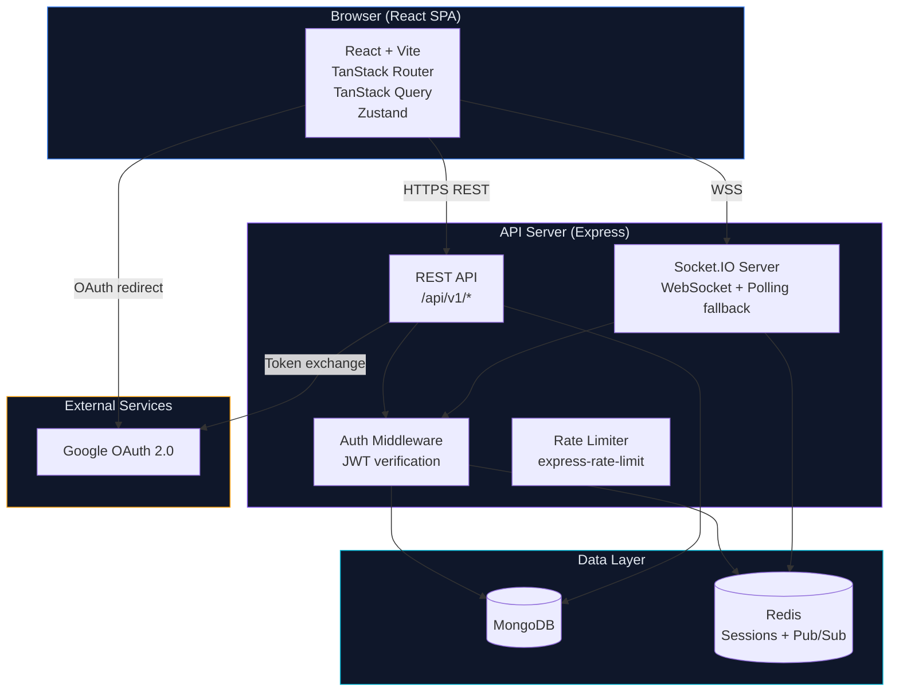
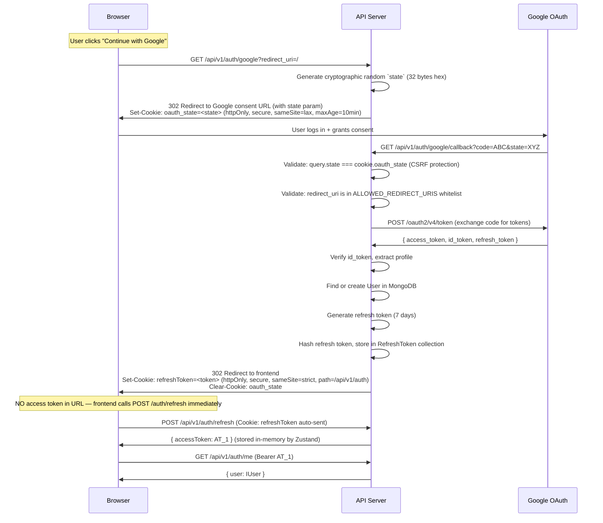
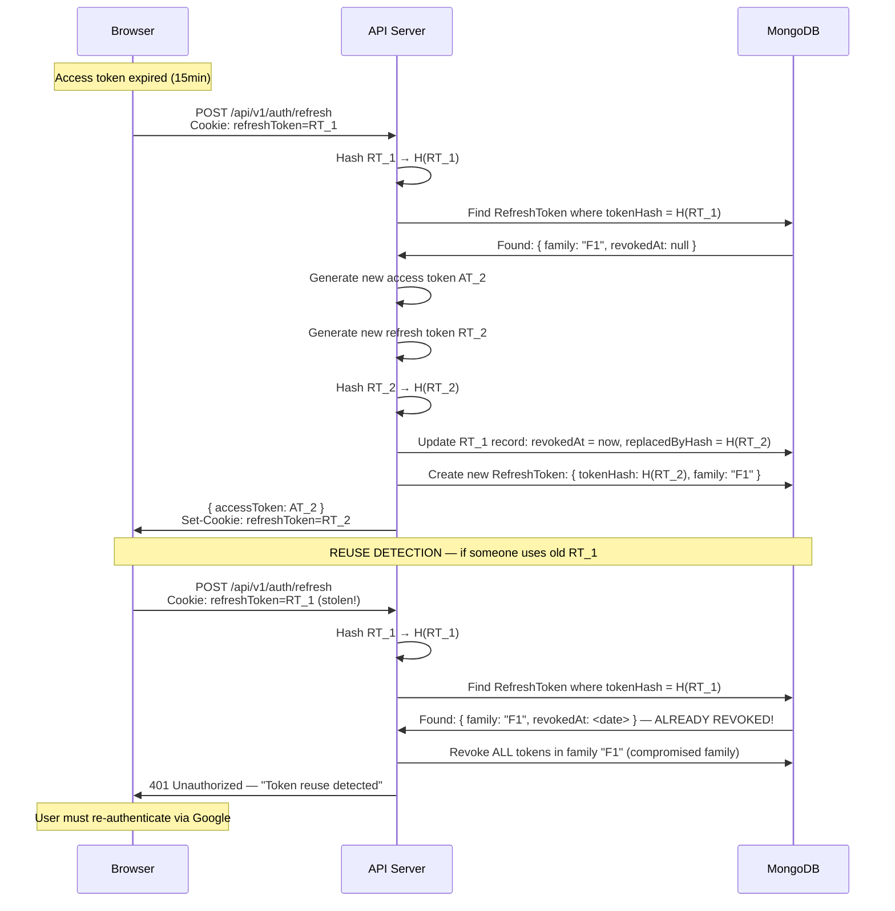

# WebChat — Comprehensive Implementation Plan

> **Project**: Real-time web chat application
> **Created**: 2026-03-22
> **Status**: Planning
> **Version**: 2.0 (post-review revision)

---

## Table of Contents

1. [Architecture Overview](#1-architecture-overview)
2. [Tech Stack](#2-tech-stack)
3. [UI/UX Specification](#3-uiux-specification)
4. [Folder Structure](#4-folder-structure)
5. [Data Models](#5-data-models)
6. [API Contract](#6-api-contract)
7. [Authentication Flow](#7-authentication-flow)
8. [WebSocket Event Contract](#8-websocket-event-contract)
9. [Architecture Decisions](#9-architecture-decisions)
10. [Implementation Phases](#10-implementation-phases)

---

## 1. Architecture Overview

### 1.1 System Architecture Diagram



### 1.2 Service Boundaries

| Service | Responsibility | Port (dev) |
|---------|---------------|------------|
| `web` | React SPA — UI rendering, client-side state, WebSocket client | 5173 |
| `api` | REST API + Socket.IO server — business logic, auth, data access | 3001 |
| `mongodb` | Document store — users, conversations, messages | 27017 |
| `redis` | Caching, session store, Socket.IO adapter for horizontal scaling | 6379 |

### 1.3 Data Flow Summary

1. **Authentication**: Browser → Google OAuth → API (token exchange) → JWT issued → stored in httpOnly cookie (refresh) + memory (access)
2. **REST calls**: Browser → API (`Authorization: Bearer <accessToken>`) → MongoDB → Response
3. **WebSocket**: Browser → Socket.IO handshake (with access token) → Persistent bidirectional connection → Real-time events
4. **Token refresh**: Browser → API (`POST /api/v1/auth/refresh`, cookie auto-sent) → New access token + rotated refresh token

---

## 2. Tech Stack

### 2.1 Frontend (`web`)

| Technology | Version | Purpose | Justification |
|-----------|---------|---------|---------------|
| React | 19.x | UI library | Industry standard, largest ecosystem, concurrent features |
| TypeScript | 5.7+ | Type safety | Strict mode enforces correctness at compile time |
| Vite | 6.x | Build tool | Fastest HMR, native ESM, excellent TypeScript support |
| TanStack Router | 1.x | Routing | Fully type-safe routes, file-based routing, built-in auth guards via `beforeLoad` |
| TanStack Query | 5.x | Server state | Automatic caching, background refetch, optimistic updates, request deduplication |
| Zustand | 5.x | Client state | Minimal API, no boilerplate, works outside React tree (Socket.IO handlers) |
| Socket.IO Client | 4.x | WebSocket | Auto-reconnect, fallback to polling, room support, acknowledgments |
| Tailwind CSS | 4.x | Styling | CSS-first design tokens via `@theme`, OKLCH colors, `@utility` for custom classes |
| Framer Motion | 12.x | Animation | Declarative animations, `AnimatePresence` for enter/exit, layout animations |
| Lucide React | latest | Icons | Tree-shakeable, consistent line-based icon set |
| @tanstack/react-virtual | 3.x | Virtualization | Headless virtualizer for message list, dynamic row heights |
| React Hook Form | 7.x | Forms | Minimal re-renders, Zod resolver for validation |
| Zod | 3.x | Validation | Schema-first validation, shared between client and API |
| date-fns | 4.x | Dates | Tree-shakeable, immutable, no global pollution (unlike moment/dayjs) |

### 2.2 Backend (`api`)

| Technology | Version | Purpose | Justification |
|-----------|---------|---------|---------------|
| Express | 5.x | HTTP framework | Native async error handling (no wrapper needed), mature ecosystem, stable. Express 5 catches rejected promises in route handlers automatically — eliminates an entire class of unhandled rejection crashes. |
| TypeScript | 5.7+ | Type safety | Same version as frontend for shared types |
| Socket.IO | 4.x | WebSocket server | Built-in rooms, acknowledgments, Redis adapter for scaling |
| Mongoose | 8.x | MongoDB ODM | TypeScript-first schemas, `.lean<T>()`, middleware hooks |
| Passport.js | 0.7+ | Auth strategy | `passport-google-oauth20` is the standard for Google OAuth |
| jsonwebtoken | 9.x | JWT | Sign/verify access and refresh tokens with separate secrets |
| helmet | 8.x | Security headers | CSP, HSTS, X-Frame-Options, etc. |
| cors | 2.x | CORS | Whitelist frontend origin, credentials: true |
| express-rate-limit | 7.x | Rate limiting | Per-IP and per-user rate limiting with Redis store |
| rate-limit-redis | 4.x | Redis store | Distributed rate limit state across instances |
| Zod | 3.x | Validation | Shared schemas with frontend for request body validation |
| pino | 9.x | Logging | Structured JSON logging, fast, log-level based |
| @socket.io/redis-adapter | 8.x | WS scaling | Pub/Sub for multi-instance Socket.IO |
| ioredis | 5.x | Redis client | Robust Redis client with cluster support |
| pino-http | 10.x | HTTP logging | Request/response logging middleware integrated with pino |
| pino-pretty | 13.x | Dev logging | Pretty-print pino logs in development (human-readable output) |
| mongodb-memory-server | 10.x | Testing | In-memory MongoDB for integration tests |
| ioredis-mock | 8.x | Testing | In-memory Redis mock for unit tests |

### 2.3 Shared / Tooling

| Technology | Version | Purpose |
|-----------|---------|---------|
| Vitest | 3.x | Test framework (both services) |
| ESLint | 9.x | Linting (flat config) |
| typescript-eslint | 8.x | TypeScript ESLint rules |
| eslint-plugin-unicorn | latest | Modern JS patterns |
| eslint-plugin-sonarjs | latest | Code smell detection |
| eslint-plugin-security | latest | Security anti-patterns (api) |
| eslint-plugin-react-hooks | latest | React hooks rules (web) |
| eslint-plugin-jsx-a11y | latest | Accessibility rules (web) |
| @tanstack/router-plugin | latest | Vite plugin for TanStack Router file-based route generation |
| Prettier | 3.x | Code formatting (consistent across all developers and AI agents) |
| eslint-config-prettier | latest | Disable ESLint rules that conflict with Prettier |
| cspell | latest | Spell checking |
| Husky | 9.x | Git hooks |
| lint-staged | 15.x | Run linters on staged files |
| commitlint | 19.x | Conventional commits |
| Docker | latest | Containerization |
| Docker Compose | latest | Local orchestration |

---

## 3. UI/UX Specification

### 3.1 Design Tokens

#### Color System (OKLCH via Tailwind v4 `@theme`)

```css
/* @theme block in app.css */
@theme {
  /* === Background Layers (darkest → lightest) === */
  --color-bg-0: oklch(0.13 0.02 260);     /* #0a0e1a — deepest background */
  --color-bg-1: oklch(0.16 0.02 260);     /* #0f1629 — sidebar, panels */
  --color-bg-2: oklch(0.20 0.02 260);     /* #151d33 — cards, elevated surfaces */
  --color-bg-3: oklch(0.24 0.02 260);     /* #1c2540 — hover states, active items */

  /* === Surface & Border === */
  --color-surface: oklch(0.22 0.02 260);  /* #192035 — input fields, dropdowns */
  --color-border: oklch(0.30 0.02 260);   /* #283352 — subtle borders */
  --color-border-bright: oklch(0.40 0.03 260); /* hover borders */

  /* === Text === */
  --color-text-primary: oklch(0.95 0.01 260);    /* #e8ecf4 — primary text */
  --color-text-secondary: oklch(0.70 0.02 260);  /* #8b95b0 — secondary/muted */
  --color-text-tertiary: oklch(0.50 0.02 260);   /* #4f5b78 — placeholder, disabled */

  /* === Accent — Electric Blue === */
  --color-accent: oklch(0.65 0.20 250);           /* #3b82f6 — primary actions */
  --color-accent-hover: oklch(0.70 0.22 250);     /* lighter on hover */
  --color-accent-muted: oklch(0.65 0.20 250 / 0.15); /* subtle background tint */

  /* === Accent 2 — Neon Violet === */
  --color-violet: oklch(0.55 0.25 290);           /* #8b5cf6 — secondary accent */
  --color-violet-hover: oklch(0.60 0.27 290);
  --color-violet-muted: oklch(0.55 0.25 290 / 0.15);

  /* === Accent 3 — Cyan === */
  --color-cyan: oklch(0.70 0.15 195);             /* #06b6d4 — online status, info */
  --color-cyan-muted: oklch(0.70 0.15 195 / 0.15);

  /* === Semantic === */
  --color-success: oklch(0.65 0.20 145);          /* #22c55e — sent, online */
  --color-warning: oklch(0.70 0.18 80);           /* #f59e0b — caution */
  --color-error: oklch(0.60 0.22 25);             /* #ef4444 — errors, destructive */
  --color-info: oklch(0.70 0.15 195);             /* same as cyan */

  /* === Own Message === */
  --color-bg-own-message: oklch(0.65 0.20 250 / 0.08); /* subtle accent tint for own messages */

  /* === Links === */
  --color-text-link: oklch(0.70 0.18 250);        /* link text */
  --color-text-link-hover: oklch(0.75 0.20 250);  /* link hover */

  /* === Code Blocks === */
  --color-code-bg: oklch(0.15 0.02 260);          /* inline and block code background */

  /* === Focus Ring (WCAG 2.4.7 compliance) === */
  --color-focus-ring: oklch(0.65 0.20 250 / 0.5); /* semi-transparent accent */
  --focus-ring-width: 2px;
  --focus-ring-offset: 2px;

  /* === Glassmorphism === */
  --color-glass: oklch(0.18 0.02 260 / 0.60);    /* semi-transparent panel */
  --color-glass-border: oklch(0.40 0.03 260 / 0.30);

  /* === Spacing Scale (rem) === */
  --spacing-xs: 0.25rem;   /* 4px */
  --spacing-sm: 0.5rem;    /* 8px */
  --spacing-md: 0.75rem;   /* 12px */
  --spacing-lg: 1rem;      /* 16px */
  --spacing-xl: 1.5rem;    /* 24px */
  --spacing-2xl: 2rem;     /* 32px */
  --spacing-3xl: 3rem;     /* 48px */

  /* === Border Radius === */
  --radius-sm: 0.375rem;   /* 6px — buttons, inputs */
  --radius-md: 0.5rem;     /* 8px — cards */
  --radius-lg: 0.75rem;    /* 12px — panels, modals */
  --radius-xl: 1rem;       /* 16px — large cards */
  --radius-full: 9999px;   /* pill shape, avatars */

  /* === Shadows & Glow === */
  --shadow-sm: 0 1px 2px oklch(0 0 0 / 0.3);
  --shadow-md: 0 4px 12px oklch(0 0 0 / 0.4);
  --shadow-lg: 0 8px 24px oklch(0 0 0 / 0.5);
  --shadow-glow-accent: 0 0 20px oklch(0.65 0.20 250 / 0.3);
  --shadow-glow-violet: 0 0 20px oklch(0.55 0.25 290 / 0.3);
  --shadow-glow-cyan: 0 0 20px oklch(0.70 0.15 195 / 0.3);

  /* === Animation Durations === */
  --duration-fast: 100ms;
  --duration-normal: 200ms;
  --duration-slow: 300ms;
  --duration-enter: 250ms;
  --duration-exit: 150ms;

  /* === Animation Easings === */
  --ease-out: cubic-bezier(0.16, 1, 0.3, 1);
  --ease-in-out: cubic-bezier(0.65, 0, 0.35, 1);
  --ease-spring: cubic-bezier(0.34, 1.56, 0.64, 1);

  /* === Typography === */
  --font-sans: 'Inter', 'Geist', system-ui, -apple-system, sans-serif;
  --font-mono: 'JetBrains Mono', 'Fira Code', 'Consolas', monospace;

  --text-xs: 0.75rem;     /* 12px */
  --text-sm: 0.8125rem;   /* 13px */
  --text-base: 0.875rem;  /* 14px — body text */
  --text-lg: 1rem;        /* 16px */
  --text-xl: 1.25rem;     /* 20px */
  --text-2xl: 1.5rem;     /* 24px */

  --leading-tight: 1.3;
  --leading-normal: 1.5;
  --leading-relaxed: 1.7;

  --tracking-tight: -0.01em;
  --tracking-normal: 0;
  --tracking-wide: 0.02em;

  /* === Font Weights === */
  --font-weight-normal: 400;    /* body text, secondary text */
  --font-weight-medium: 500;    /* button labels, input labels */
  --font-weight-semibold: 600;  /* headings, sender names, sidebar section titles */
  --font-weight-bold: 700;      /* emphasis, notification badges */

  /* === Message Layout === */
  --max-width-message-bubble: 65%;  /* max bubble width relative to container */

  /* === Scrollbar === */
  --color-scrollbar-thumb: var(--color-border);
  --color-scrollbar-thumb-hover: var(--color-border-bright);

  /* === Z-Index Scale === */
  --z-sidebar: 30;
  --z-header: 40;
  --z-dropdown: 50;
  --z-modal-backdrop: 60;
  --z-modal: 70;
  --z-toast: 80;
  --z-tooltip: 90;
}
```

#### Custom Tailwind Utilities

```css
/* Glassmorphism utility */
@utility glass {
  background: var(--color-glass);
  backdrop-filter: blur(16px) saturate(180%);
  border: 1px solid var(--color-glass-border);
}

/* Glow effects */
@utility glow-accent {
  box-shadow: var(--shadow-glow-accent);
}

@utility glow-violet {
  box-shadow: var(--shadow-glow-violet);
}

/* Focus ring — applied to all interactive elements via global style */
@utility focus-ring {
  outline: var(--focus-ring-width) solid var(--color-focus-ring);
  outline-offset: var(--focus-ring-offset);
}

/* Scrollbar styling */
@utility scrollbar-thin {
  scrollbar-width: thin;
  scrollbar-color: var(--color-scrollbar-thumb) transparent;
}
```

### 3.2 Component Inventory

#### Primitives (atomic, highly reusable)

| Component | Props | Notes |
|-----------|-------|-------|
| `Button` | `variant: 'primary' | 'secondary' | 'ghost' | 'danger'`, `size: 'sm' | 'md' | 'lg'`, `loading`, `icon` | Framer Motion hover/tap scale |
| `IconButton` | `icon`, `size`, `tooltip`, `variant` | For toolbar actions (react, reply, etc.) |
| `Input` | `label`, `error`, `icon`, `size` | Integrated with React Hook Form |
| `TextArea` | `autoResize`, `maxRows`, `onSubmit` | Shift+Enter = newline, Enter = submit |
| `Avatar` | `src`, `name`, `size: 'xs' | 'sm' | 'md' | 'lg'`, `status` | Fallback to initials + deterministic color |
| `Badge` | `variant`, `count`, `dot` | Unread counts, status dots |
| `Tooltip` | `content`, `side`, `delay` | Using `@radix-ui/react-tooltip` |
| `Dropdown` | `trigger`, `items`, `align` | Using `@radix-ui/react-dropdown-menu` |
| `Modal` | `open`, `onClose`, `title`, `size` | Using `@radix-ui/react-dialog` |
| `Skeleton` | `width`, `height`, `rounded` | Loading placeholder with pulse animation |
| `Spinner` | `size` | Animated SVG circle |
| `Divider` | `label` | Optional centered label ("Today", "New messages") |
| `Toast` | managed by store | Top-right stack, auto-dismiss, slide-in animation |
| `StatusDot` | `status: 'online' | 'idle' | 'offline'` | Pulsing green dot for online |

#### Composite Components

| Component | Description |
|-----------|-------------|
| `SidebarLayout` | 3-column layout shell: sidebar + main + optional right panel |
| `Sidebar` | Logo, search trigger, conversation list, user profile |
| `SidebarConversationItem` | Avatar, name, last message preview, unread badge, timestamp |
| `ConversationHeader` | Channel name, description, member count, actions (info, search) |
| `MessageList` | Virtualized (TanStack Virtual), infinite scroll up for history, date separators |
| `MessageBubble` | Avatar, name, timestamp, content, hover toolbar, read receipts |
| `MessageContent` | Render text, code blocks (syntax highlight via `shiki`), links |
| `MessageHoverToolbar` | Emoji react, reply, copy, delete (own messages only) |
| `MessageInput` | TextArea + formatting toolbar + emoji picker + file attach + send |
| `FormattingToolbar` | Bold, italic, strikethrough, code, link buttons |
| `EmojiPicker` | Grid of emojis, search, skin tone selector (use `@emoji-mart/react`) |
| `TypingIndicator` | Animated 3 dots + "X is typing..." / "X and Y are typing..." |
| `ReadReceipt` | Checkmark icons: sent (single) / delivered (double) / read (double blue) |
| `ConnectionStatus` | Toast-like banner: "Reconnecting..." with spinner, "Connected" with check |
| `SearchDialog` | Cmd+K modal: search conversations and messages |
| `UserProfileCard` | Avatar, name, email, status toggle, sign-out button |
| `NewConversationModal` | Search users, select participants, create DM or group |
| `MemberList` | Right panel: list of conversation members with online status |
| `EmptyState` | Centered illustration + heading + description + optional CTA |
| `AuthCard` | Glassmorphism card with Google sign-in button |
| `AnimatedBackground` | Gradient mesh or floating particles for auth screen |

### 3.3 Screen Layouts

#### Screen 1: Auth Screen

```
┌─────────────────────────────────────────────────────┐
│                                                     │
│              ┌─── AnimatedBackground ────┐          │
│              │                           │          │
│              │   ┌── AuthCard (glass) ─┐ │          │
│              │   │                     │ │          │
│              │   │     [Logo]          │ │          │
│              │   │   "WebChat"         │ │          │
│              │   │                     │ │          │
│              │   │  "Real-time chat,   │ │          │
│              │   │   reimagined."      │ │          │
│              │   │                     │ │          │
│              │   │ ┌─────────────────┐ │ │          │
│              │   │ │ Continue with   │ │ │          │
│              │   │ │ Google     [G]  │ │ │          │
│              │   │ └─────────────────┘ │ │          │
│              │   │                     │ │          │
│              │   └─────────────────────┘ │          │
│              │                           │          │
│              └───────────────────────────┘          │
│                                                     │
└─────────────────────────────────────────────────────┘
```

**Interactions:**
- `AnimatedBackground`: CSS gradient mesh animation (`@keyframes` with `background-position` shift) — lightweight, no canvas/WebGL
- `AuthCard`: `glass` utility + `shadow-lg` + `radius-xl`
- Google button: `motion.button` with `whileHover={{ scale: 1.02 }}` and `whileTap={{ scale: 0.98 }}`
- Loading state: button shows spinner after click, disables re-click
- Error state: red toast with error message below the card

#### Screen 2: Main Layout (3-panel)

```
┌──────────┬──────────────────────────────┬──────────┐
│ Sidebar  │         Center Panel         │  Right   │
│  240px   │        (flex-grow)           │  280px   │
│          │                              │(optional)│
│ [Logo]   │ ┌── ConversationHeader ────┐ │          │
│          │ │ #general  ∙  5 members   │ │ Members  │
│ [Search] │ └──────────────────────────┘ │          │
│          │                              │ ● Alice  │
│ DMs      │ ┌── MessageList ───────────┐ │ ● Bob    │
│ ● Alice  │ │                          │ │ ○ Carol  │
│ ○ Bob    │ │  [messages...]           │ │          │
│          │ │                          │ │          │
│ Channels │ │                          │ │          │
│ #general │ │                          │ │          │
│ #random  │ │                          │ │          │
│          │ └──────────────────────────┘ │          │
│ [+ New]  │                              │          │
│          │ ┌── TypingIndicator ───────┐ │          │
│          │ │ Alice is typing...       │ │          │
│          │ └──────────────────────────┘ │          │
│ ┌──────┐ │                              │          │
│ │Avatar│ │ ┌── MessageInput ──────────┐ │          │
│ │ User │ │ │ [B][I][~][</>][🔗]      │ │          │
│ └──────┘ │ │ Type a message...  [📎]↵ │ │          │
│          │ └──────────────────────────┘ │          │
└──────────┴──────────────────────────────┴──────────┘
```

**Interactions:**
- Sidebar resize: not resizable (fixed 240px), collapsible on mobile via hamburger
- Right panel: toggled via button in ConversationHeader, animated slide with `framer-motion`
- Responsive: below 768px, sidebar becomes a slide-over drawer; right panel hidden by default

#### Screen 3: Sidebar Detail

```
┌────────────────────┐
│ ┌─ Logo ─────────┐ │
│ │ ◇ WebChat      │ │
│ └────────────────┘ │
│                    │
│ ┌─ SearchTrigger ┐ │
│ │ 🔍 Search ⌘K   │ │
│ └────────────────┘ │
│                    │
│ ── Direct Messages │
│                    │
│ ┌─────────────────┐│
│ │● Alice          ││  ← green dot = online
│ │  "See you tmrw" ││  ← last message preview
│ │         2:30 PM ││  ← timestamp
│ └─────────────────┘│
│ ┌─────────────────┐│
│ │○ Bob        (2) ││  ← gray dot = offline, unread badge
│ │  "Sounds good"  ││
│ │        Yest.    ││
│ └─────────────────┘│
│                    │
│ ── Channels        │
│                    │
│ # general          │
│ # random       (5) │
│ # engineering      │
│                    │
│ ┌─────────────────┐│
│ │ + New Chat      ││  ← opens NewConversationModal
│ └─────────────────┘│
│                    │
│ ┌── UserProfile ──┐│
│ │ [Av] John Doe   ││
│ │ ● Online    ⚙  ││  ← status toggle + settings gear
│ └─────────────────┘│
└────────────────────┘
```

**Interactions:**
- Conversation items: `bg-bg-3` on hover, `bg-accent-muted` when active
- Unread badge: `Badge` with `variant="accent"`, pulsing animation if > 0
- Search trigger: opens `SearchDialog` modal (Cmd+K)
- Status toggle: dropdown with Online / Idle / Do Not Disturb / Invisible
- Right-click on conversation: context menu (mute, archive, leave, delete)

#### Screen 4: Message Bubble

```
┌──────────────────────────────────────────────┐
│                                              │
│  [Avatar]  Alice Chen          2:30 PM    │
│                                              │
│  Hey! Have you seen the new design system?   │
│                                              │
│  ┌─────────────────────────────────┐         │
│  │ const theme = {                 │         │  ← code block with syntax highlight
│  │   primary: '#3b82f6',           │         │
│  │   bg: '#0a0e1a',               │         │
│  │ };                              │         │
│  │                          [copy] │         │
│  └─────────────────────────────────┘         │
│                                              │
│  It looks amazing!                           │
│                                              │
│  ✓✓ Read                                     │  ← read receipt
│                                              │
│  ┌── HoverToolbar (appears on hover) ──────┐ │
│  │  😀  ↩️  📋  🗑️                          │ │
│  └─────────────────────────────────────────┘ │
│                                              │
└──────────────────────────────────────────────┘
```

**Interactions:**
- Hover toolbar: appears above message on hover, `motion.div` with `opacity` and `y` animation
- Code block: syntax highlighted via `shiki` (loaded lazily), copy button on hover
- Timestamp: relative ("2m ago"), full datetime on hover tooltip
- Read receipt states:
  - `✓` single gray check = sent to server
  - `✓✓` double gray check = delivered to recipient
  - `✓✓` double blue check = read by recipient
- **Own messages**: Subtle background differentiation using `--color-bg-own-message` (NOT right-aligned). Avatar hidden, name hidden, timestamp on right. Messages are left-aligned like all messages but visually distinguished by the tinted background. This preserves a consistent scan line for readability.
- **Consecutive message grouping**: Messages from the same sender within a 2-minute window are grouped:
  - First message in group: full layout (avatar, name, timestamp, content)
  - Subsequent messages: avatar hidden (indent remains for alignment), name hidden, timestamp shown only on hover, vertical spacing reduced from `--spacing-lg` to `--spacing-xs`
  - A new message from a different sender, or a gap > 2 minutes, breaks the group
- **Reactions display**: Row of emoji pills below message content. Each pill shows emoji + count (e.g., "👍 3"). Click existing pill to add same reaction. Reactions are max 1 row; overflow shows "+N more" pill that expands on click.
- Delete: only on own messages, confirms with modal. Other participants see "This message was deleted" placeholder in italic muted text.
- **Edited indicator**: "(edited)" text in `--color-text-tertiary` next to timestamp when `editedAt` is set.
- Emoji reaction: click opens small picker with frequently-used emojis

#### Screen 5: Message Input

```
┌──────────────────────────────────────────────┐
│ ┌── FormattingToolbar ─────────────────────┐ │
│ │  [B] [I] [~] [</>] [🔗]                 │ │
│ └──────────────────────────────────────────┘ │
│ ┌── TextArea ──────────────────────────────┐ │
│ │                                          │ │
│ │  Type a message...                       │ │
│ │                                 [😀][📎] │ │
│ │                                          │ │
│ └──────────────────────────────────────────┘ │
│                                         [➤] │  ← send button (enabled when content exists)
└──────────────────────────────────────────────┘
```

**Interactions:**
- Enter = send, Shift+Enter = newline
- TextArea auto-resizes up to 5 rows, then scrolls
- Formatting: wrap selection with Markdown syntax (`**bold**`, `*italic*`, `~~strike~~`, `` `code` ``, `[text](url)`)
- Emoji picker: `@emoji-mart/react`, opens as popover above the emoji button
- File attach: opens native file picker, shows file preview chip before sending
- Send button: disabled when empty, `motion.button` with `whileTap` scale
- Paste image: detect image paste, show preview, confirm send
- **Reply-in-progress state**: When user clicks "reply" on a message, a banner appears above the text area showing: `↩ Replying to [sender name]: "[truncated message preview]" [✕ dismiss]`. Background: `--color-bg-2`. Clicking dismiss clears the `replyTo` reference.
- **Edit-in-progress state**: When user clicks "edit" on their own message, the input switches to edit mode: banner above text area shows `✏ Editing message [✕ cancel]`. Original text pre-fills the textarea. Send button text changes to "Save". Pressing Escape cancels edit mode.
- **"New messages" scroll-to-bottom button**: Appears as a floating pill button centered horizontally above the input, when the user is scrolled up and new messages arrive. Shows count: "↓ 3 new messages". Click = smooth scroll to bottom. Auto-hides when user scrolls to bottom. Styled: `--color-accent` background, white text, `shadow-md`, `radius-full`.

#### Screen 6: Empty States

**No conversation selected:**
```
┌──────────────────────────────────────────────┐
│                                              │
│                                              │
│              ◇ [Illustration]                │
│                                              │
│           Welcome to WebChat                 │
│                                              │
│     Select a conversation from the           │
│     sidebar or start a new one.              │
│                                              │
│        [ Start a conversation ]              │
│                                              │
│                                              │
└──────────────────────────────────────────────┘
```

**No messages yet (conversation just created):**
```
┌──────────────────────────────────────────────┐
│                                              │
│              ◇ [Chat bubble icon]            │
│                                              │
│     This is the beginning of your            │
│     conversation with Alice.                 │
│                                              │
│     Say hello! 👋                            │
│                                              │
└──────────────────────────────────────────────┘
```

### 3.4 Interaction Specifications

#### Loading States

| Context | Behavior |
|---------|----------|
| Initial app load | Full-screen skeleton: sidebar skeleton + main skeleton |
| Conversation list | `Skeleton` items matching `SidebarConversationItem` shape |
| Message history | `Skeleton` bubbles (3-4 varied widths), scroll locked |
| Sending message | Optimistic insert with `opacity: 0.6`, replace on server confirmation |
| Image upload | Progress bar overlay on image preview chip |
| Auth redirect | Button spinner + "Redirecting to Google..." text |

#### Error States

| Context | Behavior |
|---------|----------|
| Network failure | `ConnectionStatus` banner: "Connection lost. Reconnecting..." with countdown |
| Message send failure | Red border on failed message, "Retry" icon button, tooltip with error |
| Auth failure | Toast: "Authentication failed. Please try again." + redirect to auth |
| Rate limited | Toast: "Too many requests. Please wait a moment." |
| 404 conversation | Redirect to conversation list with toast |
| Server error (5xx) | Toast: "Something went wrong. Please try again." (no stack trace exposed) |

#### Transitions

| Transition | Animation |
|-----------|-----------|
| Page navigation | `framer-motion` page wrapper with `opacity` + `y` offset (200ms) |
| Sidebar conversation switch | Instant content swap (no animation on message list) |
| Right panel toggle | `animate={{ x }}` slide from right (250ms, `easeOut`) |
| Message appear | `animate={{ opacity: 1, y: 0 }}` from `initial={{ opacity: 0, y: 8 }}` (150ms) |
| Typing indicator | 3 dots with staggered `animate={{ y: [-2, 2] }}` (infinite, 600ms) |
| Toast enter | `animate={{ x: 0, opacity: 1 }}` from right (200ms) |
| Toast exit | `animate={{ x: 100, opacity: 0 }}` (150ms) |
| Modal open | Backdrop fade (150ms) + content scale from 0.95 (200ms) |
| Hover toolbar | `animate={{ opacity: 1, y: 0 }}` from `y: 4` (100ms) |

### 3.5 Accessibility Specification

Every interactive element MUST have a visible focus indicator using the `focus-ring` utility. Focus styles are defined globally, not per-component.

#### ARIA Landmarks

| Element | ARIA Role | Notes |
|---------|-----------|-------|
| Sidebar | `<nav aria-label="Conversations">` | Primary navigation |
| Message list area | `<main>` | Main content region |
| Member list (right panel) | `<aside aria-label="Members">` | Complementary content |
| Message list | `role="log" aria-live="polite"` | Screen readers announce new messages |
| Message input | `role="textbox" aria-label="Message input"` | Clear purpose |

#### Keyboard Navigation

| Key | Context | Action |
|-----|---------|--------|
| `Tab` | Global | Move between major regions: sidebar → message list → input → right panel |
| `Arrow Up/Down` | Sidebar | Navigate between conversation items |
| `Enter` | Sidebar item focused | Open conversation |
| `Arrow Up/Down` | Message list focused | Navigate between messages |
| `Enter` | Message focused | Expand hover toolbar actions as focusable buttons |
| `Escape` | Any modal/panel | Close modal, panel, or search dialog |
| `Cmd+K` / `Ctrl+K` | Global | Open search dialog |

#### Skip Navigation

A visually hidden "Skip to message input" link at the top of the page, visible on focus. Allows keyboard users to bypass the sidebar.

#### Screen Reader Announcements

- New message: `aria-live="polite"` region announces "[Sender] says: [first 100 chars of message]"
- During rapid message streams (> 3 messages in 5 seconds): batch announcements as "[N] new messages from [Sender(s)]"
- Typing indicator: `aria-live="polite"` announces "[Name] is typing"
- Connection status changes: `aria-live="assertive"` for "Connection lost" (interrupts), `aria-live="polite"` for "Reconnected"

#### Icon Button Accessibility

All `IconButton` components MUST pass `tooltip` text as both `aria-label` and tooltip content. The `tooltip` prop is mandatory, not optional.

#### Color Contrast Verification

| Token Pair | Calculated Ratio | WCAG AA (4.5:1) |
|-----------|------------------|-----------------|
| `text-primary` on `bg-0` | ~15:1 | PASS |
| `text-secondary` on `bg-0` | ~5.2:1 | PASS |
| `text-tertiary` on `bg-0` | ~2.8:1 | FAIL — use only for decorative/non-essential text, never for actionable content |
| `accent` on `bg-0` | ~6.1:1 | PASS |
| `text-primary` on `bg-2` | ~11:1 | PASS |

> **Note**: `text-tertiary` fails WCAG AA for normal text. It is permitted ONLY for placeholder text in inputs and non-essential decorative elements. Any text that conveys information must use `text-secondary` or `text-primary`.

### 3.6 Timestamp Formatting Rules

| Condition | Format | Example |
|-----------|--------|---------|
| < 1 minute | "Just now" | Just now |
| < 60 minutes | "Xm ago" | 5m ago |
| Today | "HH:mm" (24h) or "h:mm A" (12h based on locale) | 2:30 PM |
| Yesterday | "Yesterday" | Yesterday |
| This year | "MMM d" | Mar 15 |
| Older | "MMM d, yyyy" | Mar 15, 2025 |
| Hover tooltip (always) | Full datetime | "Saturday, March 15, 2026 at 2:30 PM" |

Sidebar conversation items use the same rules. Message list timestamps use relative for recent, absolute for older.

### 3.7 Date Separator Rules

- Separator appears between messages from different calendar days
- Label format: "Today", "Yesterday", or "March 15, 2026" (for older dates)
- Uses user's local timezone (not server time)
- Separator is NOT sticky during scroll (static position in the list)

### 3.8 Search Dialog (Cmd+K) Specification

- Opens as a centered modal with backdrop
- Input at top with auto-focus, instant search (debounced 300ms)
- Results categorized in sections: "Conversations" (matches on name/participant), "Messages" (matches on content, shows conversation name + date)
- Each result item: icon (conversation or message), title, subtitle (preview/context), right-aligned date
- Arrow keys navigate results, Enter selects, Escape closes
- Selecting a conversation navigates to it; selecting a message navigates to the conversation and scrolls to that message
- Minimum query length: 2 characters

---

## 4. Folder Structure

### 4.1 Root (monorepo)

```
webchat/
├── .agents/                         # Agent configuration (existing)
│   ├── config/
│   │   ├── AGENTS.MD
│   │   └── secrets.yml
│   └── rules/                       # Coding rules for AI agents
├── .claude/                         # Claude Code settings (existing)
├── .husky/                          # Git hooks
│   ├── pre-commit                   # lint-staged
│   └── commit-msg                   # commitlint
├── packages/
│   └── shared/                      # Shared types + Zod schemas
│       ├── src/
│       │   ├── index.ts             # Re-export barrel
│       │   ├── schemas/             # Zod schemas (shared validation)
│       │   │   ├── auth.schema.ts
│       │   │   ├── conversation.schema.ts
│       │   │   ├── message.schema.ts
│       │   │   └── user.schema.ts
│       │   ├── types/               # TypeScript type definitions
│       │   │   ├── api.types.ts     # REST request/response types
│       │   │   ├── socket.types.ts  # Socket.IO event types
│       │   │   ├── models.types.ts  # Data model interfaces
│       │   │   └── index.ts
│       │   └── constants/
│       │       ├── events.ts        # Socket event name constants
│       │       └── limits.ts        # Shared limits (max message length, etc.)
│       ├── tsconfig.json            # extends base, composite: true
│       └── package.json             # exports: { ".": "./src/index.ts" }
│
│   # Shared package consumption strategy:
│   # - package.json "exports" points directly to TypeScript source
│   # - Vite (web) resolves .ts natively via its bundler
│   # - tsx (api dev) resolves .ts natively
│   # - tsc (api prod build) uses project references with composite: true
│   # - No separate build step needed for the shared package
├── api/                             # Express API server
│   └── (see 4.2)
├── web/                             # React SPA
│   └── (see 4.3)
├── docker-compose.yml               # Production build orchestration
├── docker-compose.dev.yml           # Local dev: MongoDB + Redis only (api/web run natively)
├── .env.example                     # Example env vars (no secrets — sentinel values for secrets)
├── .gitignore                       # Must include: .env, node_modules, dist, coverage
├── .prettierrc                      # Prettier configuration
├── .commitlintrc.json               # Commitlint config
├── Makefile                         # Single-command dev setup: `make dev`
├── package.json                     # Root package.json (workspaces)
├── pnpm-workspace.yaml              # pnpm workspace config
├── cspell.config.yaml               # Spell check dictionary
└── docs/
    └── plans/
        └── 00-webchat-implementation-plan.md  # This file
```

### 4.2 API Service

```
api/
├── src/
│   ├── app.ts                       # Express app factory (no listen)
│   ├── server.ts                    # HTTP server + Socket.IO bootstrap + listen
│   ├── config/
│   │   ├── env.ts                   # Zod-validated environment variables
│   │   ├── database.ts              # Mongoose connection setup
│   │   ├── redis.ts                 # ioredis client setup
│   │   ├── passport.ts              # Passport Google strategy config
│   │   └── socket.ts                # Socket.IO server config + Redis adapter
│   ├── middleware/
│   │   ├── auth.middleware.ts        # JWT verification for REST routes
│   │   ├── error-handler.middleware.ts # Global error handler (no stack exposure)
│   │   ├── rate-limit.middleware.ts  # express-rate-limit configs
│   │   ├── validate.middleware.ts    # Zod schema validation middleware
│   │   ├── request-id.middleware.ts  # Add correlation ID to every request
│   │   └── not-found.middleware.ts   # 404 handler
│   ├── routes/
│   │   ├── index.ts                 # Route aggregator
│   │   ├── auth.routes.ts           # /api/v1/auth/*
│   │   ├── user.routes.ts           # /api/v1/users/*
│   │   ├── conversation.routes.ts   # /api/v1/conversations/*
│   │   └── message.routes.ts        # /api/v1/messages/*
│   ├── controllers/
│   │   ├── auth.controller.ts
│   │   ├── user.controller.ts
│   │   ├── conversation.controller.ts
│   │   └── message.controller.ts
│   ├── services/
│   │   ├── auth.service.ts          # Token generation, refresh rotation, Google OAuth
│   │   ├── user.service.ts          # User CRUD, search, profile update
│   │   ├── conversation.service.ts  # Create, list, update conversations
│   │   └── message.service.ts       # Send, list, mark read/delivered
│   ├── models/
│   │   ├── user.model.ts            # Mongoose User schema + model
│   │   ├── conversation.model.ts    # Mongoose Conversation schema + model
│   │   ├── message.model.ts         # Mongoose Message schema + model
│   │   ├── message-receipt.model.ts # Read/delivery tracking (separate collection)
│   │   ├── conversation-member.model.ts
│   │   └── refresh-token.model.ts   # Mongoose RefreshToken schema + model
│   ├── guards/
│   │   ├── membership.guard.ts      # assertMembership(userId, conversationId) — shared by REST + Socket
│   │   ├── ownership.guard.ts       # assertMessageOwner(userId, messageId) — edit/delete own messages
│   │   └── index.ts
│   ├── socket/
│   │   ├── index.ts                 # Socket.IO initialization + namespace setup
│   │   ├── auth.socket.ts           # Socket authentication middleware
│   │   ├── handlers/
│   │   │   ├── message.handler.ts   # send_message, message_delivered, message_read
│   │   │   ├── typing.handler.ts    # typing_start, typing_stop
│   │   │   ├── presence.handler.ts  # presence_update, join_room, leave_room
│   │   │   └── connection.handler.ts # connect, disconnect, reconnect
│   │   └── emitters/
│   │       ├── message.emitter.ts   # Emit message events to rooms
│   │       ├── typing.emitter.ts    # Emit typing events
│   │       └── presence.emitter.ts  # Emit presence changes
│   ├── lib/
│   │   ├── logger.ts               # pino logger instance (pino-pretty in dev via transport)
│   │   ├── jwt.ts                   # JWT sign/verify (algorithm: 'HS256' pinned)
│   │   ├── hash.ts                  # SHA-256 hashing for refresh tokens (crypto.createHash)
│   │   ├── errors.ts               # Custom error classes (AppError, etc.)
│   │   └── assert-defined.ts       # Utility for noUncheckedIndexedAccess safe access
│   └── __tests__/
│       ├── setup.ts                 # mongodb-memory-server lifecycle + ioredis-mock + test helpers
│       ├── factories/               # Test data factories
│       │   ├── user.factory.ts      # createTestUser()
│       │   ├── conversation.factory.ts # createTestConversation()
│       │   └── message.factory.ts   # createTestMessage()
│       ├── integration/
│       │   ├── auth.test.ts
│       │   ├── conversation.test.ts
│       │   ├── message.test.ts
│       │   └── socket.test.ts       # Socket.IO integration (in-process server + socket.io-client)
│       └── unit/
│           ├── services/
│           │   ├── auth.service.test.ts
│           │   ├── conversation.service.test.ts
│           │   └── message.service.test.ts
│           └── lib/
│               ├── jwt.test.ts
│               └── hash.test.ts
├── Dockerfile                       # Multi-stage: build → production
├── tsconfig.json
├── vitest.config.ts
├── eslint.config.ts                 # Flat config with type-checked + security
└── package.json
```

### 4.3 Web Service

```
web/
├── src/
│   ├── main.tsx                     # React entry point
│   ├── app.tsx                      # TanStack Router provider + QueryClient provider
│   ├── styles/
│   │   └── app.css                  # Tailwind imports + @theme tokens + @utility
│   ├── routes/
│   │   ├── __root.tsx               # Root layout (TanStack Router)
│   │   ├── _auth.tsx                # Auth layout wrapper (redirect if not logged in)
│   │   ├── _auth/
│   │   │   ├── index.tsx            # Main chat view (default conversation or empty state)
│   │   │   └── c/$conversationId.tsx # Specific conversation view
│   │   └── login.tsx                # Auth screen
│   ├── components/
│   │   ├── ui/                      # Primitive/atomic components
│   │   │   ├── button.tsx
│   │   │   ├── icon-button.tsx
│   │   │   ├── input.tsx
│   │   │   ├── text-area.tsx
│   │   │   ├── avatar.tsx
│   │   │   ├── badge.tsx
│   │   │   ├── tooltip.tsx
│   │   │   ├── dropdown.tsx
│   │   │   ├── modal.tsx
│   │   │   ├── skeleton.tsx
│   │   │   ├── spinner.tsx
│   │   │   ├── divider.tsx
│   │   │   ├── toast.tsx
│   │   │   └── status-dot.tsx
│   │   ├── layout/                  # Layout components
│   │   │   ├── sidebar-layout.tsx
│   │   │   ├── sidebar.tsx
│   │   │   ├── sidebar-conversation-item.tsx
│   │   │   ├── conversation-header.tsx
│   │   │   ├── member-list.tsx
│   │   │   └── user-profile-card.tsx
│   │   ├── chat/                    # Chat-specific components
│   │   │   ├── message-list.tsx
│   │   │   ├── message-bubble.tsx
│   │   │   ├── message-content.tsx
│   │   │   ├── message-hover-toolbar.tsx
│   │   │   ├── message-input.tsx
│   │   │   ├── formatting-toolbar.tsx
│   │   │   ├── emoji-picker.tsx
│   │   │   ├── typing-indicator.tsx
│   │   │   ├── read-receipt.tsx
│   │   │   └── connection-status.tsx
│   │   ├── auth/                    # Auth screen components
│   │   │   ├── auth-card.tsx
│   │   │   └── animated-background.tsx
│   │   ├── search/
│   │   │   └── search-dialog.tsx
│   │   ├── modals/
│   │   │   └── new-conversation-modal.tsx
│   │   └── empty-states/
│   │       ├── no-conversation.tsx
│   │       └── no-messages.tsx
│   ├── hooks/
│   │   ├── use-auth.ts              # Auth state + token refresh
│   │   ├── use-socket.ts            # Socket.IO connection lifecycle
│   │   ├── use-messages.ts          # TanStack Query + socket for messages
│   │   ├── use-conversations.ts     # TanStack Query for conversations
│   │   ├── use-typing.ts            # Typing indicator logic + debounce
│   │   ├── use-presence.ts          # Online/offline status tracking
│   │   ├── use-toast.ts             # Toast trigger hook
│   │   └── use-keyboard-shortcut.ts # Cmd+K, Escape, etc.
│   ├── stores/
│   │   ├── auth.store.ts            # Zustand: access token, user info
│   │   ├── socket.store.ts          # Zustand: connection status, socket instance
│   │   ├── ui.store.ts              # Zustand: sidebar open, right panel open, active modal
│   │   └── toast.store.ts           # Zustand: toast queue
│   ├── lib/
│   │   ├── api-client.ts            # Axios/fetch wrapper with token refresh interceptor
│   │   ├── socket-client.ts         # Socket.IO client setup + event binding
│   │   ├── query-client.ts          # TanStack Query client config
│   │   └── format.ts               # Date formatting, message preview truncation
│   ├── __tests__/
│   │   ├── setup.ts                 # Test setup (happy-dom, MSW)
│   │   ├── components/
│   │   │   ├── message-bubble.test.tsx
│   │   │   └── message-input.test.tsx
│   │   └── hooks/
│   │       ├── use-auth.test.ts
│   │       └── use-messages.test.ts
│   └── vite-env.d.ts
├── public/
│   └── favicon.svg
├── index.html
├── Dockerfile                       # Multi-stage: build → nginx
├── tsconfig.json
├── tsconfig.app.json
├── tsconfig.node.json
├── vite.config.ts
├── vitest.config.ts
├── eslint.config.ts                 # Flat config with react-hooks + jsx-a11y
├── .dockerignore                    # Exclude node_modules, .env, .git, dist, coverage
└── package.json
# Note: No tailwind.config.ts — Tailwind v4 uses CSS-only config via @theme in app.css
```

---

## 5. Data Models

### 5.1 User

```typescript
// packages/shared/src/types/models.types.ts

interface IUser {
  _id: string;
  googleId: string;
  email: string;
  displayName: string;
  avatarUrl: string;
  status: 'online' | 'idle' | 'dnd' | 'offline';
  lastSeenAt: Date;
  createdAt: Date;
  updatedAt: Date;
}
```

```typescript
// api/src/models/user.model.ts

import { Schema, model } from 'mongoose';

const USER_STATUS = {
  ONLINE: 'online',
  IDLE: 'idle',
  DND: 'dnd',
  OFFLINE: 'offline',
} as const;

type UserStatus = typeof USER_STATUS[keyof typeof USER_STATUS];

interface IUserDocument {
  googleId: string;
  email: string;
  displayName: string;
  avatarUrl: string;
  status: UserStatus;
  lastSeenAt: Date;
  createdAt: Date;
  updatedAt: Date;
}

const userSchema = new Schema<IUserDocument>(
  {
    googleId: { type: String, required: true, unique: true },
    email: { type: String, required: true, unique: true, lowercase: true },
    displayName: { type: String, required: true, maxlength: 100 },
    avatarUrl: {
      type: String,
      default: '',
      validate: {
        validator: (v: string) => v === '' || /^https:\/\/.+/.test(v),
        message: 'avatarUrl must be an HTTPS URL',
      },
      // Also validated at API boundary via Zod: z.string().url().startsWith('https://')
      // Prevents stored SSRF and XSS via arbitrary protocol URLs (javascript:, data:, etc.)
    },
    status: {
      type: String,
      enum: Object.values(USER_STATUS),
      default: USER_STATUS.OFFLINE,
    },
    lastSeenAt: { type: Date, default: Date.now },
  },
  { timestamps: true }
);

// Indexes
userSchema.index({ email: 1 });
userSchema.index({ googleId: 1 });
userSchema.index({ displayName: 'text' }); // Text search for user lookup

const UserModel = model<IUserDocument>('User', userSchema);
```

### 5.2 Conversation

```typescript
// packages/shared/src/types/models.types.ts

interface IConversation {
  _id: string;
  type: 'direct' | 'group';
  name: string | null;                // null for DMs, custom name for groups
  dmKey: string | null;               // Sorted participant IDs joined by ":" for DM dedup (e.g., "id1:id2")
  participants: string[];             // User IDs
  lastMessageId: string | null;       // Reference to most recent Message (populate on read)
  sequenceCounter: number;            // Atomic counter for message ordering
  createdBy: string;
  createdAt: Date;
  updatedAt: Date;
}
```

```typescript
// api/src/models/conversation.model.ts

const CONVERSATION_TYPE = {
  DIRECT: 'direct',
  GROUP: 'group',
} as const;

type ConversationType = typeof CONVERSATION_TYPE[keyof typeof CONVERSATION_TYPE];

interface IConversationDocument {
  conversationType: ConversationType; // Renamed from 'type' to avoid Mongoose keyword conflict
  name: string | null;
  dmKey: string | null;               // Sorted "userId1:userId2" for DM deduplication
  participants: Schema.Types.ObjectId[];
  lastMessageId: Schema.Types.ObjectId | null; // Reference only — populate on read
  sequenceCounter: number;            // Atomic counter for message ordering
  createdBy: Schema.Types.ObjectId;
  createdAt: Date;
  updatedAt: Date;
}

const conversationSchema = new Schema<IConversationDocument>(
  {
    conversationType: {
      type: String,
      enum: Object.values(CONVERSATION_TYPE),
      required: true,
    },
    name: { type: String, default: null, maxlength: 100 },
    dmKey: { type: String, default: null },
    participants: [
      { type: Schema.Types.ObjectId, ref: 'User', required: true },
    ],
    lastMessageId: {
      type: Schema.Types.ObjectId,
      ref: 'Message',
      default: null,
    },
    sequenceCounter: { type: Number, default: 0 },
    createdBy: { type: Schema.Types.ObjectId, ref: 'User', required: true },
  },
  { timestamps: true }
);

// Indexes
conversationSchema.index({ participants: 1 });
conversationSchema.index({ updatedAt: -1 }); // Sort conversations by most recent activity
conversationSchema.index(
  { dmKey: 1 },
  { unique: true, partialFilterExpression: { dmKey: { $ne: null } } }
  // Enforce: only one DM conversation per participant pair via sorted dmKey
  // Service layer MUST sort participant IDs and join with ":" before insertion
);
```

### 5.3 Message

```typescript
// packages/shared/src/types/models.types.ts

interface IMessage {
  _id: string;
  conversationId: string;
  senderId: string;
  clientMessageId: string;            // Client-generated UUID for idempotent sends (upsert on send)
  sequenceNumber: number;             // Per-conversation atomic counter for deterministic ordering
  content: string;
  contentType: 'text' | 'image' | 'file';
  replyTo: string | null;             // Message ID being replied to
  reactions: Array<{
    emoji: string;                    // Validated Unicode emoji (single codepoint or ZWJ sequence)
    userId: string;
  }>;                                 // Max 50 reactions per message, 1 per emoji per user
  editedAt: Date | null;
  deletedAt: Date | null;             // Soft delete
  createdAt: Date;
  updatedAt: Date;
}

// Read/delivery receipts stored in separate collection — see Section 5.6 MessageReceipt
// This avoids unbounded array growth and write contention in group conversations
```

```typescript
// api/src/models/message.model.ts

const CONTENT_TYPE = {
  TEXT: 'text',
  IMAGE: 'image',
  FILE: 'file',
} as const;

type ContentType = typeof CONTENT_TYPE[keyof typeof CONTENT_TYPE];

// Note: Message status (sent/delivered/read) is now tracked per-recipient
// in the MessageReceipt collection (Section 5.6) — not on the Message document itself.

interface IMessageDocument {
  conversationId: Schema.Types.ObjectId;
  senderId: Schema.Types.ObjectId;
  clientMessageId: string;             // Client-generated UUID — compound unique with conversationId
  sequenceNumber: number;              // Assigned server-side via atomic increment
  content: string;
  contentType: ContentType;
  replyTo: Schema.Types.ObjectId | null;
  reactions: Array<{
    emoji: string;                     // Validated: /^\p{Emoji_Presentation}(\u200d\p{Emoji_Presentation})*/u
    userId: Schema.Types.ObjectId;
  }>;                                  // Capped at 50 entries; 1 per emoji per user enforced in service layer
  editedAt: Date | null;
  deletedAt: Date | null;
  createdAt: Date;
  updatedAt: Date;
}

const messageSchema = new Schema<IMessageDocument>(
  {
    conversationId: {
      type: Schema.Types.ObjectId,
      ref: 'Conversation',
      required: true,
    },
    senderId: {
      type: Schema.Types.ObjectId,
      ref: 'User',
      required: true,
    },
    clientMessageId: {
      type: String,
      required: true,
      // Client-generated UUID for idempotent message sends.
      // Service layer uses upsert with { conversationId, clientMessageId } to prevent duplicates on retry.
    },
    sequenceNumber: {
      type: Number,
      required: true,
      // Assigned server-side via Conversation.findOneAndUpdate(
      //   { _id: conversationId },
      //   { $inc: { sequenceCounter: 1 } },
      //   { returnDocument: 'after' }
      // ).sequenceCounter
      // Guarantees deterministic ordering even under multi-instance deployment.
    },
    content: { type: String, required: true, maxlength: 10000 },
    contentType: {
      type: String,
      enum: Object.values(CONTENT_TYPE),
      default: CONTENT_TYPE.TEXT,
    },
    replyTo: { type: Schema.Types.ObjectId, ref: 'Message', default: null },
    reactions: [
      {
        emoji: {
          type: String,
          required: true,
          validate: {
            validator: (v: string) =>
              /^\p{Emoji_Presentation}(\u200d\p{Emoji_Presentation})*/u.test(v),
            message: 'Invalid emoji',
          },
        },
        userId: { type: Schema.Types.ObjectId, ref: 'User', required: true },
      },
    ],
    editedAt: { type: Date, default: null },
    deletedAt: { type: Date, default: null },
  },
  { timestamps: true }
);

// Indexes
messageSchema.index({ conversationId: 1, sequenceNumber: -1 }); // Paginated message history (deterministic order)
messageSchema.index({ conversationId: 1, createdAt: -1 });      // Fallback pagination by timestamp
messageSchema.index({ conversationId: 1, clientMessageId: 1 }, { unique: true }); // Idempotent upsert
messageSchema.index({ conversationId: 1, senderId: 1 });        // Messages by sender in conversation
messageSchema.index({ deletedAt: 1 });                           // Filter soft-deleted messages
```

### 5.4 RefreshToken

```typescript
// api/src/models/refresh-token.model.ts

interface IRefreshTokenDocument {
  userId: Schema.Types.ObjectId;
  tokenHash: string;               // SHA-256 hash of the refresh token
  family: string;                  // Token family ID for rotation detection
  expiresAt: Date;
  revokedAt: Date | null;
  replacedByHash: string | null;   // Hash of the token that replaced this one
  userAgent: string;
  ipAddress: string;
  createdAt: Date;
}

const refreshTokenSchema = new Schema<IRefreshTokenDocument>(
  {
    userId: { type: Schema.Types.ObjectId, ref: 'User', required: true },
    tokenHash: { type: String, required: true, unique: true },
    family: { type: String, required: true },
    expiresAt: { type: Date, required: true },
    revokedAt: { type: Date, default: null },
    replacedByHash: { type: String, default: null },
    userAgent: { type: String, default: '' },
    ipAddress: { type: String, default: '' },
  },
  { timestamps: true }
);

// Indexes
refreshTokenSchema.index({ userId: 1 });
refreshTokenSchema.index({ tokenHash: 1 });
refreshTokenSchema.index({ family: 1 });
refreshTokenSchema.index({ expiresAt: 1 }, { expireAfterSeconds: 0 }); // TTL index — auto-cleanup
```

### 5.5 ConversationMember (for per-user conversation metadata)

```typescript
// api/src/models/conversation-member.model.ts

interface IConversationMemberDocument {
  conversationId: Schema.Types.ObjectId;
  userId: Schema.Types.ObjectId;
  lastReadMessageId: Schema.Types.ObjectId | null;
  unreadCount: number;
  mutedUntil: Date | null;
  joinedAt: Date;
  leftAt: Date | null;
}

const conversationMemberSchema = new Schema<IConversationMemberDocument>({
  conversationId: {
    type: Schema.Types.ObjectId,
    ref: 'Conversation',
    required: true,
  },
  userId: {
    type: Schema.Types.ObjectId,
    ref: 'User',
    required: true,
  },
  lastReadMessageId: {
    type: Schema.Types.ObjectId,
    ref: 'Message',
    default: null,
  },
  unreadCount: { type: Number, default: 0 },
  mutedUntil: { type: Date, default: null },
  joinedAt: { type: Date, default: Date.now },
  leftAt: { type: Date, default: null },
});

// Indexes
conversationMemberSchema.index(
  { conversationId: 1, userId: 1 },
  { unique: true }
);
conversationMemberSchema.index({ userId: 1, leftAt: 1 }); // Active memberships for a user
```

### 5.6 MessageReceipt (read/delivery tracking — separate collection)

> **Why a separate collection?** Embedding `readBy`/`deliveredTo` arrays on the Message document
> causes unbounded document growth and write contention in group conversations.
> Each message × recipient creates one receipt. Write amplification is bounded
> (one upsert per recipient per state change) and queries use compound indexes.

```typescript
// packages/shared/src/types/models.types.ts

const RECEIPT_STATUS = {
  DELIVERED: 'delivered',
  READ: 'read',
} as const;

type ReceiptStatus = typeof RECEIPT_STATUS[keyof typeof RECEIPT_STATUS];

interface IMessageReceipt {
  _id: string;
  messageId: string;
  conversationId: string;             // Denormalized for efficient per-conversation queries
  userId: string;                     // Recipient
  status: ReceiptStatus;
  deliveredAt: Date | null;
  readAt: Date | null;
}
```

```typescript
// api/src/models/message-receipt.model.ts

interface IMessageReceiptDocument {
  messageId: Schema.Types.ObjectId;
  conversationId: Schema.Types.ObjectId;
  userId: Schema.Types.ObjectId;
  status: ReceiptStatus;
  deliveredAt: Date | null;
  readAt: Date | null;
}

const messageReceiptSchema = new Schema<IMessageReceiptDocument>(
  {
    messageId: {
      type: Schema.Types.ObjectId,
      ref: 'Message',
      required: true,
    },
    conversationId: {
      type: Schema.Types.ObjectId,
      ref: 'Conversation',
      required: true,
    },
    userId: {
      type: Schema.Types.ObjectId,
      ref: 'User',
      required: true,
    },
    status: {
      type: String,
      enum: Object.values(RECEIPT_STATUS),
      required: true,
    },
    deliveredAt: { type: Date, default: null },
    readAt: { type: Date, default: null },
  },
  { timestamps: false } // Use deliveredAt/readAt instead
);

// Indexes
messageReceiptSchema.index(
  { messageId: 1, userId: 1 },
  { unique: true } // One receipt per message per recipient
);
messageReceiptSchema.index({ conversationId: 1, userId: 1, status: 1 }); // Unread count queries
messageReceiptSchema.index({ messageId: 1, status: 1 });                 // "Read by N" display
```

> **Usage patterns:**
> - **Mark delivered**: `MessageReceipt.updateOne({ messageId, userId }, { $set: { status: 'delivered', deliveredAt: new Date() } }, { upsert: true })`
> - **Mark read**: `MessageReceipt.updateOne({ messageId, userId }, { $set: { status: 'read', readAt: new Date() } }, { upsert: true })`
> - **Unread count recovery**: `MessageReceipt.countDocuments({ conversationId, userId, status: { $ne: 'read' } })`
> - **Batch mark read**: When user opens a conversation, batch-upsert receipts for all messages after their `lastReadMessageId`

---

## 6. API Contract

### 6.1 REST Endpoints

Base URL: `/api/v1`

#### Auth Routes (`/api/v1/auth`)

| Method | Path | Description | Auth | Request | Response |
|--------|------|-------------|------|---------|----------|
| GET | `/auth/google` | Redirect to Google OAuth consent screen | No | Query: `redirect_uri` | 302 redirect to Google (with `state` cookie set) |
| GET | `/auth/google/callback` | Handle Google OAuth callback | No | Query: `code`, `state` + Cookie: `oauth_state` | 302 redirect to frontend (httpOnly cookie set, no token in URL) |
| POST | `/auth/refresh` | Refresh access token | Cookie | Cookie: `refreshToken` | `{ accessToken: string }` |
| POST | `/auth/logout` | Revoke refresh token + clear cookie | Yes | Cookie: `refreshToken` | `{ success: true }` |
| GET | `/auth/me` | Get current user profile | Yes | — | `{ user: IUser }` |
| POST | `/auth/dev-login` | **DEV ONLY** — bypass OAuth for local development | No | Body: `{ email, displayName }` | `{ accessToken: string }` + refreshToken cookie |

> **`POST /auth/dev-login`**: Only available when `NODE_ENV=development`. Creates or finds a user
> by email, generates tokens, and returns them. This eliminates the need for real Google OAuth
> credentials during local development. The route handler MUST check `NODE_ENV` and return 404
> in any other environment.

#### User Routes (`/api/v1/users`)

| Method | Path | Description | Auth | Request | Response |
|--------|------|-------------|------|---------|----------|
| GET | `/users/search` | Search users by name/email | Yes | Query: `q`, `limit` | `{ users: IUser[] }` |
| GET | `/users/:id` | Get user by ID | Yes | — | `{ user: IUser }` |
| PATCH | `/users/me/status` | Update own status | Yes | Body: `{ status }` | `{ user: IUser }` |
| PATCH | `/users/me/profile` | Update own profile | Yes | Body: `{ displayName?, avatarUrl? }` | `{ user: IUser }` |

#### Conversation Routes (`/api/v1/conversations`)

| Method | Path | Description | Auth | Request | Response |
|--------|------|-------------|------|---------|----------|
| GET | `/conversations` | List user's conversations | Yes | Query: `page`, `limit` | `{ conversations: IConversationWithMeta[], total: number }` |
| POST | `/conversations` | Create conversation | Yes | Body: `{ type, participantIds, name? }` | `{ conversation: IConversation }` |
| GET | `/conversations/:id` | Get conversation details | Yes | — | `{ conversation: IConversationWithMeta }` |
| PATCH | `/conversations/:id` | Update conversation (name) | Yes | Body: `{ name }` | `{ conversation: IConversation }` |
| DELETE | `/conversations/:id/leave` | Leave conversation | Yes | — | `{ success: true }` |
| GET | `/conversations/:id/members` | List members | Yes | — | `{ members: IUser[] }` |

#### Message Routes (`/api/v1/messages`)

| Method | Path | Description | Auth | Request | Response |
|--------|------|-------------|------|---------|----------|
| GET | `/conversations/:id/messages` | List messages (paginated) | Yes | Query: `before`, `limit` | `{ messages: IMessage[], hasMore: boolean }` |
| POST | `/conversations/:id/messages` | Send message (REST fallback) | Yes | Body: `{ content, contentType?, replyTo? }` | `{ message: IMessage }` |
| PATCH | `/messages/:id` | Edit message | Yes | Body: `{ content }` | `{ message: IMessage }` |
| DELETE | `/messages/:id` | Soft-delete message | Yes | — | `{ success: true }` |
| POST | `/messages/:id/reactions` | Add reaction | Yes | Body: `{ emoji }` | `{ message: IMessage }` |
| DELETE | `/messages/:id/reactions/:emoji` | Remove reaction | Yes | — | `{ message: IMessage }` |

#### Health Routes

| Method | Path | Description | Auth | Response |
|--------|------|-------------|------|----------|
| GET | `/health` | Public health check (load balancer / uptime monitor) | No | `{ status: 'ok' }` |
| GET | `/health/details` | Internal detailed health (infrastructure monitoring) | Internal | `{ status: 'ok', uptime: number, mongo: 'connected', redis: 'connected', version: string }` |

> **Security note**: The public `/health` endpoint exposes ONLY the status field.
> Infrastructure details (MongoDB/Redis connection state, uptime, version) are on `/health/details`
> which is protected by an internal API key header (`X-Health-Key`) or restricted to private network.
> This prevents attackers from fingerprinting infrastructure components.

### 6.2 Request/Response Types (shared package)

```typescript
// packages/shared/src/types/api.types.ts

// === Auth ===
interface RefreshResponse {
  accessToken: string;
}

interface MeResponse {
  user: IUser;
}

// === Users ===
interface SearchUsersQuery {
  q: string;
  limit?: number; // default 10, max 50
}

interface SearchUsersResponse {
  users: IUser[];
}

interface UpdateStatusBody {
  status: 'online' | 'idle' | 'dnd' | 'offline';
}

interface UpdateProfileBody {
  displayName?: string;                // z.string().min(1).max(100)
  avatarUrl?: string;                  // z.string().url().startsWith('https://') — HTTPS only, prevents stored SSRF
}

// === Conversations ===
interface CreateConversationBody {
  type: 'direct' | 'group';
  participantIds: string[];
  name?: string; // required for group, ignored for direct
}

interface ListConversationsQuery {
  page?: number;  // default 1
  limit?: number; // default 20, max 50
}

interface IConversationWithMeta extends IConversation {
  unreadCount: number;
  lastReadMessageId: string | null;
  participantDetails: Pick<IUser, '_id' | 'displayName' | 'avatarUrl' | 'status'>[];
}

interface ListConversationsResponse {
  conversations: IConversationWithMeta[];
  total: number;
}

// === Messages ===
interface SendMessageBody {
  clientMessageId: string;             // Client-generated UUID — required for idempotent sends
  content: string;
  contentType?: 'text' | 'image' | 'file';
  replyTo?: string;
}

interface ListMessagesQuery {
  before?: string; // Message ID — cursor-based pagination
  limit?: number;  // default 30, max 100
}

interface ListMessagesResponse {
  messages: IMessage[];
  hasMore: boolean;
}

interface EditMessageBody {
  content: string;
}

interface AddReactionBody {
  emoji: string;
}

// === Health ===
interface HealthResponse {
  status: 'ok' | 'degraded';
}

interface HealthDetailResponse extends HealthResponse {
  uptime: number;
  mongo: 'connected' | 'disconnected';
  redis: 'connected' | 'disconnected';
  version: string;
}

// === Error ===
interface ApiError {
  error: string;
  code: string;
  details?: unknown;
}

// === Pagination ===
interface PaginatedResponse<T> {
  data: T[];
  total: number;
  page: number;
  limit: number;
  hasMore: boolean;
}
```

---

## 7. Authentication Flow

### 7.1 Google OAuth Sequence



> **Security: OAuth state parameter (CSRF protection)**
> 1. `/auth/google` generates `state = crypto.randomBytes(32).toString('hex')`
> 2. `state` is stored in a short-lived httpOnly cookie (`oauth_state`, maxAge 10 min)
> 3. `state` is also passed to Google as a query parameter
> 4. `/auth/google/callback` compares `req.query.state` with `req.cookies.oauth_state`
> 5. If they don't match → 403 (prevents CSRF on the callback)
> 6. `redirect_uri` is validated against a whitelist (`ALLOWED_REDIRECT_URIS` env var)
>
> **Security: No token in URL**
> The callback ONLY sets httpOnly cookies. The access token is NEVER delivered via URL
> hash fragment or query parameter. This prevents token leakage via browser history,
> Referer headers, server logs, and shared links. The frontend obtains the access token
> by calling `POST /auth/refresh` after the redirect.

### 7.2 JWT Lifecycle

| Token | Storage | Lifetime | Contains | Algorithm |
|-------|---------|----------|----------|-----------|
| Access Token | In-memory (Zustand store) | 15 minutes | `{ sub: userId, email, iat, exp }` | HS256 |
| Refresh Token | httpOnly cookie | 7 days | Random UUID (opaque) | N/A (not a JWT) |

**JWT Algorithm Pinning (CRITICAL — prevents alg:none attack)**

```typescript
// api/src/lib/jwt.ts

// ALWAYS pin algorithm on BOTH sign and verify — prevents alg:none/alg:HS256-with-RSA attacks
const JWT_CONFIG = {
  algorithm: 'HS256' as const,         // Pin on sign
  allowedAlgorithms: ['HS256'] as const, // Pin on verify — reject any other algorithm
};

function signAccessToken(payload: AccessTokenPayload): string {
  return jwt.sign(payload, JWT_ACCESS_SECRET, {
    algorithm: JWT_CONFIG.algorithm,
    expiresIn: '15m',
  });
}

function verifyAccessToken(token: string): AccessTokenPayload {
  return jwt.verify(token, JWT_ACCESS_SECRET, {
    algorithms: [...JWT_CONFIG.allowedAlgorithms], // MUST specify — without this, jwt.verify accepts alg:none
  }) as AccessTokenPayload;
}
```

> **Why separate secrets?** `JWT_ACCESS_SECRET` and `JWT_REFRESH_SECRET` are different keys.
> If the access token secret is compromised, the attacker cannot forge refresh tokens (and vice versa).

**Why in-memory for access token?**
- Not accessible to XSS (unlike localStorage)
- Lost on page refresh → automatic silent refresh via httpOnly cookie
- Short lifetime limits damage window if somehow leaked

**Why httpOnly cookie for refresh token?**
- Not accessible to JavaScript → immune to XSS
- `sameSite: strict` → immune to CSRF
- `path: /api/v1/auth` → only sent to auth endpoints, not every API call
- `secure: true` → HTTPS only in production

### 7.3 Refresh Token Rotation Strategy



**Key security properties:**
1. **Rotation**: Each refresh generates a new refresh token, old one is revoked
2. **Family tracking**: All tokens from a single login session share a `family` ID
3. **Reuse detection**: If a revoked token is used, the entire family is revoked (attacker + legitimate user both get logged out → user re-authenticates, attacker is locked out)
4. **TTL auto-cleanup**: MongoDB TTL index on `expiresAt` automatically deletes expired tokens

### 7.4 Token Refresh on the Frontend

```typescript
// Pseudocode for api-client.ts interceptor

// On 401 response:
// 1. Queue the failed request
// 2. Call POST /auth/refresh (cookie auto-sent)
// 3. If success: update Zustand access token, replay queued requests
// 4. If failure: clear auth state, redirect to /login

// On app startup:
// 1. No access token in memory (fresh page load)
// 2. Call POST /auth/refresh silently
// 3. If success: store access token, proceed to app
// 4. If failure: show login screen
```

---

## 8. WebSocket Event Contract

### 8.1 Event Types (shared package)

```typescript
// packages/shared/src/types/socket.types.ts

// === Client → Server Events ===
// SECURITY: Every event that takes a conversationId MUST call assertMembership(socket.data.userId, conversationId)
// before processing. This guard is implemented in api/src/socket/guards.ts and used in every handler.
// Without this, any authenticated user can interact with any conversation.

interface ClientToServerEvents {
  join_room: (data: { conversationId: string }) => void;    // Guard: assertMembership
  leave_room: (data: { conversationId: string }) => void;   // Guard: assertMembership

  send_message: (
    data: {
      conversationId: string;                                // Guard: assertMembership
      clientMessageId: string; // Client-generated UUID for idempotent sends (replaces tempId)
      content: string;
      contentType: 'text' | 'image' | 'file';
      replyTo?: string;
    },
    ack: (response: { messageId: string; sequenceNumber: number } | { error: string }) => void
  ) => void;

  message_delivered: (data: {
    messageId: string;
    conversationId: string;                                  // Guard: assertMembership
  }) => void;

  message_read: (data: {
    messageIds: string[];
    conversationId: string;                                  // Guard: assertMembership
  }) => void;

  typing_start: (data: { conversationId: string }) => void; // Guard: assertMembership
  typing_stop: (data: { conversationId: string }) => void;  // Guard: assertMembership

  presence_update: (data: {
    status: 'online' | 'idle' | 'dnd' | 'offline';
  }) => void;
  // No conversationId — presence is user-scoped, not conversation-scoped
}

// === Socket Event Validation ===
// Every incoming event payload is validated with Zod before processing.
// Invalid payloads emit an 'error' event back to the client and are not processed.
//
// Example:
//   const SendMessageSchema = z.object({
//     conversationId: z.string().length(24), // MongoDB ObjectId
//     clientMessageId: z.string().uuid(),
//     content: z.string().min(1).max(10000),
//     contentType: z.enum(['text', 'image', 'file']).default('text'),
//     replyTo: z.string().length(24).optional(),
//   });
//
// Handler pattern:
//   socket.on('send_message', async (data, ack) => {
//     const parsed = SendMessageSchema.safeParse(data);
//     if (!parsed.success) return ack({ error: 'Invalid payload' });
//     await assertMembership(socket.data.userId, parsed.data.conversationId);
//     // ... process message
//   });

// === Server → Client Events ===
interface ServerToClientEvents {
  new_message: (data: {
    message: IMessage;
    conversationId: string;
  }) => void;

  message_updated: (data: {
    message: IMessage;
    conversationId: string;
  }) => void;

  message_deleted: (data: {
    messageId: string;
    conversationId: string;
  }) => void;

  message_status_changed: (data: {
    messageId: string;
    conversationId: string;
    status: 'delivered' | 'read';
    userId: string;
    timestamp: Date;
  }) => void;

  user_typing: (data: {
    conversationId: string;
    userId: string;
    displayName: string;
  }) => void;

  user_stopped_typing: (data: {
    conversationId: string;
    userId: string;
  }) => void;

  presence_changed: (data: {
    userId: string;
    status: 'online' | 'idle' | 'dnd' | 'offline';
    lastSeenAt: Date;
  }) => void;

  reaction_added: (data: {
    messageId: string;
    conversationId: string;
    emoji: string;
    userId: string;
  }) => void;

  reaction_removed: (data: {
    messageId: string;
    conversationId: string;
    emoji: string;
    userId: string;
  }) => void;

  error: (data: { code: string; message: string }) => void;
}

// === Inter-server Events (via Redis adapter) ===
interface InterServerEvents {
  ping: () => void;
}

// === Socket Data (attached to each socket) ===
interface SocketData {
  userId: string;
  email: string;
}
```

### 8.2 Socket.IO Server Configuration

```typescript
// Pseudocode for socket setup

const io = new Server<
  ClientToServerEvents,
  ServerToClientEvents,
  InterServerEvents,
  SocketData
>(httpServer, {
  cors: { origin: WEB_URL, credentials: true },
  pingInterval: 25000,
  pingTimeout: 20000,
  maxHttpBufferSize: 1e6, // 1MB max payload
  connectionStateRecovery: {
    maxDisconnectionDuration: 2 * 60 * 1000, // 2 minutes
    skipMiddlewares: false, // MUST be false — re-run auth middleware on reconnect to re-validate JWT
    // Setting true would allow reconnection without re-authentication, bypassing token expiry checks
  },
});

// Redis adapter for multi-instance scaling
io.adapter(createAdapter(pubClient, subClient));

// Auth middleware — verify JWT from handshake
io.use(socketAuthMiddleware);
```

### 8.3 Room Strategy

| Room Name | Format | Purpose |
|-----------|--------|---------|
| Conversation room | `conversation:<conversationId>` | All members of a conversation |
| User room | `user:<userId>` | Personal room for direct notifications |

**On connect:**
1. Authenticate via JWT in `socket.handshake.auth.token`
2. Join `user:<userId>` room
3. Fetch user's conversation list
4. Join `conversation:<id>` for each active conversation
5. Broadcast `presence_changed` (online) to relevant users

**On disconnect:**
1. Update `lastSeenAt` in MongoDB
2. Broadcast `presence_changed` (offline) to relevant users
3. Auto-leave all rooms

### 8.4 Authorization Rules (per-endpoint and per-event)

> **Principle**: Authentication (who are you?) is handled by middleware.
> Authorization (can you do this?) MUST be checked in every handler.

#### REST endpoint authorization

| Endpoint | Authorization Rule |
|----------|-------------------|
| `GET /conversations` | Only returns conversations where user is an active member |
| `POST /conversations` | Creator must include self in participants |
| `GET /conversations/:id` | `assertMembership(userId, conversationId)` |
| `PATCH /conversations/:id` | Member only; only creator can rename groups |
| `DELETE /conversations/:id/leave` | Must be active member |
| `GET /conversations/:id/members` | `assertMembership(userId, conversationId)` |
| `GET /conversations/:id/messages` | `assertMembership(userId, conversationId)` |
| `POST /conversations/:id/messages` | `assertMembership(userId, conversationId)` |
| `PATCH /messages/:id` | Must be message sender (ownership check) |
| `DELETE /messages/:id` | Must be message sender (ownership check) |
| `POST /messages/:id/reactions` | `assertMembership(userId, message.conversationId)` |
| `DELETE /messages/:id/reactions/:emoji` | Must be reaction owner |
| `PATCH /users/me/*` | Implicit — `me` resolved from JWT, cannot modify other users |

#### Socket event authorization

| Event | Authorization Rule |
|-------|-------------------|
| `join_room` | `assertMembership(userId, conversationId)` — prevents joining arbitrary rooms |
| `leave_room` | `assertMembership(userId, conversationId)` |
| `send_message` | `assertMembership(userId, conversationId)` |
| `message_delivered` | `assertMembership(userId, conversationId)` |
| `message_read` | `assertMembership(userId, conversationId)` |
| `typing_start/stop` | `assertMembership(userId, conversationId)` |
| `presence_update` | No conversation context — user-scoped only |

#### Guard implementation

```typescript
// api/src/socket/guards.ts (also used by REST via service layer)

async function assertMembership(userId: string, conversationId: string): Promise<void> {
  const member = await ConversationMember.findOne({
    userId,
    conversationId,
    leftAt: null, // Must be active member
  }).lean();
  if (!member) throw new ForbiddenError('Not a member of this conversation');
}

async function assertMessageOwner(userId: string, messageId: string): Promise<IMessage> {
  const message = await Message.findById(messageId).lean<IMessage>();
  if (!message) throw new NotFoundError('Message not found');
  if (message.senderId.toString() !== userId) throw new ForbiddenError('Not the message sender');
  return message;
}
```

---

## 9. Architecture Decisions

### 9.1 State Management: Zustand + TanStack Query

**Decision**: Use **Zustand** for client-only state + **TanStack Query** for all server state.

**Justification:**
- **TanStack Query** handles all server data (conversations, messages, user profiles) with built-in caching, background refetch, optimistic updates, and request deduplication. This eliminates the need to manually sync server state.
- **Zustand** handles pure client state: auth tokens in memory, UI state (sidebar open, active modal), socket connection status, toast queue. Zustand's API is minimal (no providers, no boilerplate) and works outside the React tree — critical for Socket.IO event handlers that need to read/update state.
- **Why not Redux?** Over-engineered for this scope. Redux's action/reducer pattern adds boilerplate without benefit when TanStack Query already manages server state.
- **Why not Jotai?** Atom-based model is ideal for derived state but adds complexity for the socket integration pattern where imperative access to the store (outside React) is needed. Zustand's `getState()` and `subscribe()` are simpler for this.

### 9.2 WebSocket Reconnection & Message Ordering

**Reconnection strategy:**
- Socket.IO's built-in reconnection with exponential backoff: `reconnectionDelay: 1000`, `reconnectionDelayMax: 10000`, `reconnectionAttempts: Infinity`
- **Connection State Recovery** (Socket.IO v4.6+): Server buffers events during brief disconnections (up to 2 minutes). On reconnect, missed events are replayed automatically. This eliminates the need for manual catch-up logic for short outages.
- For disconnections longer than 2 minutes: client fetches latest messages via REST (`GET /conversations/:id/messages`) and reconciles with the TanStack Query cache.

**Message ordering:**
- Messages are ordered by `sequenceNumber` (per-conversation atomic counter), NOT by `createdAt`.
  - `sequenceNumber` is assigned server-side via `Conversation.findOneAndUpdate({ _id }, { $inc: { sequenceCounter: 1 } }, { returnDocument: 'after' })`.
  - This guarantees deterministic ordering even under multi-instance deployment (two messages created at the same `createdAt` millisecond will have different sequence numbers).
  - `createdAt` remains as a fallback and for display purposes.
- The `clientMessageId` field (client-generated UUID) is used for both:
  1. Idempotent upsert on send (prevents duplicates on retry)
  2. Matching optimistic updates with server-confirmed messages
- In the message list, sort by `sequenceNumber` ascending. New messages append to the bottom.

### 9.3 Optimistic UI Updates for Messages

**Strategy:**
1. User hits send → generate `clientMessageId` (UUID via `crypto.randomUUID()`)
2. Immediately insert a "pending" message into the TanStack Query cache (with `opacity: 0.6` styling)
3. Emit `send_message` via Socket.IO with acknowledgment callback
4. On acknowledgment success: replace the temp message in cache with the server-returned `IMessage` (matched by `clientMessageId`)
5. On acknowledgment error: mark the temp message as "failed" (red border, retry button)
6. Retry sends the SAME `clientMessageId` → server upserts → no duplicates

**TanStack Query integration:**
```typescript
// Pseudocode
const sendMutation = useMutation({
  mutationFn: (data) => socketEmit('send_message', data),
  onMutate: async (newMessage) => {
    await queryClient.cancelQueries({ queryKey: ['messages', conversationId] });
    const previous = queryClient.getQueryData(['messages', conversationId]);
    queryClient.setQueryData(['messages', conversationId], (old) => ({
      ...old,
      messages: [...old.messages, {
        ...newMessage,
        _id: `temp-${newMessage.clientMessageId}`,
        _isPending: true, // UI marker — not persisted
      }],
    }));
    return { previous };
  },
  onError: (err, newMessage, context) => {
    queryClient.setQueryData(['messages', conversationId], context.previous);
  },
  onSettled: () => {
    queryClient.invalidateQueries({ queryKey: ['messages', conversationId] });
  },
});
```

### 9.4 MongoDB Indexes for Performance

**Complete index list (consolidated from all models):**

| Collection | Index | Type | Purpose |
|-----------|-------|------|---------|
| `users` | `{ googleId: 1 }` | Unique | OAuth lookup |
| `users` | `{ email: 1 }` | Unique | Email lookup |
| `users` | `{ displayName: 'text' }` | Text | User search |
| `conversations` | `{ participants: 1 }` | Regular | Find conversations for a user |
| `conversations` | `{ updatedAt: -1 }` | Regular | Sort by most recent activity |
| `conversations` | `{ dmKey: 1 }` | Unique (partial, `dmKey != null`) | One DM per participant pair |
| `messages` | `{ conversationId: 1, sequenceNumber: -1 }` | Compound | Paginated message history (deterministic order) |
| `messages` | `{ conversationId: 1, createdAt: -1 }` | Compound | Fallback pagination by timestamp |
| `messages` | `{ conversationId: 1, clientMessageId: 1 }` | Unique | Idempotent message upsert |
| `messages` | `{ conversationId: 1, senderId: 1 }` | Compound | Messages by sender |
| `messages` | `{ deletedAt: 1 }` | Regular | Filter soft-deleted |
| `messageReceipts` | `{ messageId: 1, userId: 1 }` | Unique | One receipt per message per recipient |
| `messageReceipts` | `{ conversationId: 1, userId: 1, status: 1 }` | Compound | Unread count queries |
| `messageReceipts` | `{ messageId: 1, status: 1 }` | Compound | "Read by N" display |
| `refreshTokens` | `{ tokenHash: 1 }` | Unique | Token lookup |
| `refreshTokens` | `{ userId: 1 }` | Regular | All tokens for a user |
| `refreshTokens` | `{ family: 1 }` | Regular | Family revocation |
| `refreshTokens` | `{ expiresAt: 1 }` | TTL | Auto-cleanup |
| `conversationMembers` | `{ conversationId: 1, userId: 1 }` | Unique | Member lookup |
| `conversationMembers` | `{ userId: 1, leftAt: 1 }` | Compound | Active memberships |

### 9.5 File Upload Strategy

**Decision**: Deferred to post-MVP. The data model supports `contentType: 'image' | 'file'` in messages, but actual upload functionality is out of scope for the initial build.

**Future approach (when implemented):**
- Upload endpoint: `POST /api/v1/uploads` with `multer` middleware
- Storage: local filesystem in development, S3-compatible storage (Cloudflare R2 or AWS S3) in production
- Flow: upload file → get URL → send message with `contentType: 'image'` and URL in `content`
- Limits: 10MB per file, image compression on upload
- Validation: MIME type whitelist (images, PDFs, common doc types)

### 9.6 Rate Limiting Strategy

| Tier | Scope | Window | Limit | Purpose |
|------|-------|--------|-------|---------|
| Global | Per IP | 15 min | 300 requests | General abuse prevention |
| Auth | Per IP | 15 min | 10 requests | Brute-force prevention on auth endpoints |
| Message send | Per User | 1 min | 30 messages | Spam prevention |
| API search | Per User | 1 min | 20 requests | Prevent search abuse |

**Implementation:**
- `express-rate-limit` with `rate-limit-redis` store (shared state across instances)
- Custom `keyGenerator` for per-user limits: extract user ID from JWT
- Rate limit headers returned: `RateLimit-Limit`, `RateLimit-Remaining`, `RateLimit-Reset` (IETF draft standard)

### 9.7 Refresh Token Storage & Rotation

See [Section 7.3](#73-refresh-token-rotation-strategy) for the complete rotation strategy.

**Summary:**
- Stored as SHA-256 hash in MongoDB (never store raw tokens)
- Family-based rotation with reuse detection
- TTL auto-cleanup via MongoDB TTL index
- Separate JWT secret for access vs refresh tokens
- Cookie configuration: `httpOnly`, `secure`, `sameSite: strict`, `path: /api/v1/auth`

### 9.8 Redis Pub/Sub for Multi-Instance Scaling

**Decision**: Include Redis from the start, even for single-instance development.

**Justification:**
- Socket.IO's `@socket.io/redis-adapter` allows horizontal scaling with zero code changes
- Redis also serves as the `rate-limit-redis` store
- Redis can cache frequently accessed data (online users, typing state) to reduce MongoDB load
- In development, Redis runs in Docker Compose alongside MongoDB

**Configuration:**
```typescript
// Two separate Redis connections (required by Socket.IO adapter)
const pubClient = new Redis(REDIS_URL);
const subClient = pubClient.duplicate();
io.adapter(createAdapter(pubClient, subClient));
```

### 9.9 Multiple Browser Tabs & Presence Deduplication

**Problem**: A user opens WebChat in 3 browser tabs. Each tab creates a separate Socket.IO connection. Without deduplication:
- User appears "online" 3 times (3 presence events)
- User closes 1 tab → "offline" event sent → user appears offline while 2 tabs are still open
- Typing indicators fire 3 times per keystroke

**Solution**: Track per-user socket count in Redis.

```typescript
// Redis key: `user_sockets:<userId>` → integer count

// On connect:
const count = await redis.incr(`user_sockets:${userId}`);
if (count === 1) {
  // First connection — broadcast presence_changed: online
  broadcastPresence(userId, 'online');
}

// On disconnect:
const count = await redis.decr(`user_sockets:${userId}`);
if (count === 0) {
  // Last connection closed — broadcast presence_changed: offline
  await redis.del(`user_sockets:${userId}`);
  broadcastPresence(userId, 'offline');
} else if (count < 0) {
  // Safety: reset to 0 if somehow negative (crash recovery)
  await redis.del(`user_sockets:${userId}`);
}
```

**Typing deduplication**: Store typing state in Redis with a short TTL. Only emit `user_typing` if the key doesn't already exist:
```typescript
const key = `typing:${conversationId}:${userId}`;
const isNew = await redis.set(key, '1', 'EX', 5, 'NX'); // 5s TTL, set-if-not-exists
if (isNew) io.to(`conversation:${conversationId}`).emit('user_typing', { ... });
```

### 9.10 `noUncheckedIndexedAccess` Patterns

**Why this flag?** With `noUncheckedIndexedAccess: true`, array element access (`arr[0]`) and record access (`obj[key]`) return `T | undefined` instead of `T`. This catches real bugs where an index might be out of bounds, but requires explicit narrowing at every access point.

**Canonical patterns for this codebase:**

```typescript
// Pattern 1: Guard clause (preferred for early returns)
const firstMessage = messages[0];
if (!firstMessage) return; // TypeScript narrows to IMessage after this line

// Pattern 2: Nullish coalescing (for default values)
const displayName = participants[0]?.displayName ?? 'Unknown';

// Pattern 3: assertDefined utility (for cases where undefined is a programming error)
// packages/shared/src/utils/assert.ts
function assertDefined<T>(value: T | undefined, name: string): T {
  if (value === undefined) throw new Error(`Expected ${name} to be defined`);
  return value;
}

// Usage: const user = assertDefined(users[0], 'users[0]');

// Pattern 4: Map + filter for array processing
const names = messages
  .map((m) => m.senderId) // m is IMessage (not IMessage | undefined) inside .map()
  .filter(Boolean);

// Anti-pattern — DO NOT DO THIS:
// const first = messages[0]!; // Non-null assertion — forbidden by TypeScript strict rules
```

### 9.11 Unread Count Recovery

**Problem**: `ConversationMember.unreadCount` can drift out of sync with actual `MessageReceipt` state
(e.g., if a receipt upsert succeeds but the counter increment fails, or during a deployment).

**Solution**: Provide a `recalculateUnreadCount()` function callable on mismatch detection.

```typescript
async function recalculateUnreadCount(userId: string, conversationId: string): Promise<number> {
  const member = await ConversationMember.findOne({ userId, conversationId }).lean();
  if (!member) return 0;

  // Count messages in this conversation after lastReadMessageId that the user hasn't read
  const filter: Record<string, unknown> = {
    conversationId,
    senderId: { $ne: userId }, // Don't count own messages
  };
  if (member.lastReadMessageId) {
    filter.sequenceNumber = { $gt: (await Message.findById(member.lastReadMessageId).lean())?.sequenceNumber ?? 0 };
  }

  const actualCount = await Message.countDocuments(filter);
  await ConversationMember.updateOne({ userId, conversationId }, { $set: { unreadCount: actualCount } });
  return actualCount;
}
```

> **When to call**: On `message_read` events if the client detects a mismatch between displayed and calculated count. Also callable via an admin/debug endpoint for bulk reconciliation.

### 9.12 Environment Variables

#### API Service (`.env`)

```bash
# Server
PORT=3001
NODE_ENV=development
WEB_URL=http://localhost:5173

# MongoDB
MONGODB_URI=mongodb://localhost:27017/webchat

# Redis
REDIS_URL=redis://localhost:6379

# JWT
JWT_ACCESS_SECRET=<random-64-char>
JWT_REFRESH_SECRET=<different-random-64-char>
JWT_ACCESS_EXPIRES_IN=15m
JWT_REFRESH_EXPIRES_IN=7d

# Google OAuth
GOOGLE_CLIENT_ID=<from-google-console>
GOOGLE_CLIENT_SECRET=<from-google-console>
GOOGLE_CALLBACK_URL=http://localhost:3001/api/v1/auth/google/callback
ALLOWED_REDIRECT_URIS=http://localhost:5173  # Comma-separated whitelist for OAuth redirect_uri validation

# Rate Limiting
RATE_LIMIT_WINDOW_MS=900000
RATE_LIMIT_MAX=300

# Logging
LOG_LEVEL=debug
```

#### Web Service (`.env`)

```bash
VITE_API_URL=http://localhost:3001
VITE_WS_URL=http://localhost:3001
VITE_APP_NAME=WebChat
```

**Validation**: Both services validate environment variables at startup using Zod schemas. Missing or invalid variables cause immediate process exit with a clear error message.

---

## 10. Implementation Phases

### Phase 0: Monorepo Setup & Tooling

**Goal**: Establish the project foundation with all tooling configured and verified. No application code yet — only infrastructure.

#### Tasks

**0.1 — Initialize pnpm workspace monorepo**
- Create root `package.json` with `"private": true` and workspace config
- Create `pnpm-workspace.yaml` pointing to `api/`, `web/`, `packages/shared/`
- Initialize each workspace package with its own `package.json`

**0.2 — Configure TypeScript**
- Root `tsconfig.base.json` with shared strict settings:
  ```json
  {
    "compilerOptions": {
      "strict": true,
      "noImplicitAny": true,
      "strictNullChecks": true,
      "noUncheckedIndexedAccess": true,
      // "exactOptionalPropertyTypes": REMOVED — breaks Mongoose models with `default: null`
      // (Mongoose optional fields require `Type | undefined`, which conflicts with `Type | null` defaults)
      "noImplicitReturns": true,
      "noFallthroughCasesInSwitch": true,
      "forceConsistentCasingInFileNames": true,
      "moduleResolution": "bundler",
      "module": "ESNext",
      "target": "ES2022",
      "esModuleInterop": true,
      "skipLibCheck": true,
      "declaration": true,
      "declarationMap": true,
      "sourceMap": true
    }
  }
  ```
- `api/tsconfig.json` extends base, sets `outDir`, includes `src/**/*.ts`
- `web/tsconfig.json` extends base with Vite-specific settings (`"jsx": "react-jsx"`)
- `packages/shared/tsconfig.json` extends base with `"composite": true` for project references
  ```json
  {
    "extends": "../../tsconfig.base.json",
    "compilerOptions": {
      "composite": true,
      "outDir": "dist",
      "rootDir": "src"
    },
    "include": ["src"]
  }
  ```
- **Shared package consumption strategy**: Each consumer (`api/`, `web/`) references the shared
  package via TypeScript project references in their `tsconfig.json`:
  ```json
  {
    "references": [{ "path": "../packages/shared" }]
  }
  ```
  And in their `package.json`: `"@webchat/shared": "workspace:*"`
  The shared package `package.json` exports point at TypeScript source directly:
  ```json
  {
    "exports": { ".": { "import": "./src/index.ts" } },
    "types": "./src/index.ts"
  }
  ```
  Each consumer's bundler (Vite for web, tsx/tsup for api) resolves `.ts` imports natively.

> **`noUncheckedIndexedAccess` usage patterns**: See [Section 9.10](#910-nouncheckedindexedaccess-patterns)
> for canonical patterns (guard clauses, nullish coalescing, `assertDefined` utility).

**0.3 — Configure ESLint (flat config)**
- Root `eslint.config.ts` with shared rules:
  - `@typescript-eslint/recommended-type-checked`
  - `eslint-plugin-unicorn/recommended`
  - `eslint-plugin-sonarjs/recommended`
  - All rules set to `"error"`, zero `"warn"`
- `api/eslint.config.ts` extends root + adds `eslint-plugin-security`
- `web/eslint.config.ts` extends root + adds:
  - `eslint-plugin-react-hooks`
  - `eslint-plugin-jsx-a11y`
- Add `no-console: "error"` to both services

**0.4 — Configure cspell**
- `cspell.config.yaml` at root with:
  - Language: `en`
  - Custom dictionary for project terms: `webchat`, `zustand`, `tanstack`, `shiki`, `pino`, `lucide`, `glassmorphism`, etc.
  - Glob patterns to include `**/*.ts`, `**/*.tsx`
  - Exclude `node_modules`, `dist`, `coverage`

**0.5 — Configure Husky + lint-staged + commitlint**
- Install Husky, create `.husky/pre-commit`:
  ```bash
  npx lint-staged
  ```
- `lint-staged` config in root `package.json`:
  ```json
  {
    "lint-staged": {
      "*.{ts,tsx}": [
        "eslint --fix",
        "cspell --no-progress"
      ]
    }
  }
  ```
- Note: `tsc --noEmit` and `vitest --related` are NOT in lint-staged (they need full project context, not individual files). Instead, add them as npm scripts and run in CI.
- `.husky/commit-msg`:
  ```bash
  npx --no -- commitlint --edit "$1"
  ```
- `.commitlintrc.json`:
  ```json
  {
    "extends": ["@commitlint/config-conventional"]
  }
  ```

**0.6 — Configure Docker**

> **Strategy**: Run MongoDB + Redis in Docker for local dev. Run api/web natively with `pnpm dev`.
> Production Dockerfiles are separate — used only for CI/CD builds, NOT for local development.
> This avoids the contradictory pattern of mounting source volumes into production images.

- `docker-compose.dev.yml` (infrastructure services ONLY):
  ```yaml
  # Local development — infrastructure services only
  # api and web run natively via `pnpm dev` for fast HMR and debugging
  services:
    mongodb:
      image: mongo:7
      ports: ["27017:27017"]
      volumes: [mongodb_data:/data/db]
      healthcheck:
        test: mongosh --eval "db.adminCommand('ping')"
        interval: 10s
        timeout: 5s
        retries: 5

    redis:
      image: redis:7-alpine
      ports: ["6379:6379"]
      healthcheck:
        test: redis-cli ping
        interval: 10s
        timeout: 5s
        retries: 5

  volumes:
    mongodb_data:
  ```

- `api/Dockerfile` (production multi-stage):
  ```dockerfile
  # Stage 1: Build
  FROM node:22-alpine AS builder
  WORKDIR /app
  COPY package.json pnpm-lock.yaml ./
  RUN corepack enable && pnpm install --frozen-lockfile
  COPY . .
  RUN pnpm build

  # Stage 2: Production
  FROM node:22-alpine
  RUN addgroup -S app && adduser -S app -G app
  WORKDIR /app
  COPY --from=builder /app/dist ./dist
  COPY --from=builder /app/node_modules ./node_modules
  COPY --from=builder /app/package.json ./
  USER app
  EXPOSE 3001
  CMD ["node", "dist/server.js"]
  ```

- `web/Dockerfile` (production multi-stage → nginx):
  ```dockerfile
  # Stage 1: Build
  FROM node:22-alpine AS builder
  WORKDIR /app
  COPY package.json pnpm-lock.yaml ./
  RUN corepack enable && pnpm install --frozen-lockfile
  COPY . .
  RUN pnpm build

  # Stage 2: Serve
  FROM nginx:alpine
  COPY --from=builder /app/dist /usr/share/nginx/html
  COPY nginx.conf /etc/nginx/conf.d/default.conf
  EXPOSE 80
  ```

- `web/nginx.conf` (SPA fallback + static asset caching):
  ```nginx
  server {
    listen 80;
    root /usr/share/nginx/html;
    index index.html;

    # SPA fallback — all routes serve index.html
    location / {
      try_files $uri $uri/ /index.html;
    }

    # Cache static assets aggressively (Vite hashed filenames)
    location /assets/ {
      expires 1y;
      add_header Cache-Control "public, immutable";
    }

    # Gzip compression
    gzip on;
    gzip_types text/plain text/css application/json application/javascript text/xml;
    gzip_min_length 256;

    # Health check for load balancer
    location /nginx-health {
      return 200 'ok';
      add_header Content-Type text/plain;
    }
  }
  ```

- `.dockerignore` (add to both `api/` and `web/`):
  ```
  node_modules
  dist
  coverage
  .env
  .git
  *.md
  .vscode
  ```

- `.env.example` with all variables (values replaced with placeholders)

- **Single dev command**: `pnpm start:dev` in root `package.json`:
  ```json
  "start:dev": "docker compose -f docker-compose.dev.yml up -d && pnpm dev"
  ```

**0.7 — Configure Vitest**
- `api/vitest.config.ts`:
  ```typescript
  import { defineConfig } from 'vitest/config';
  export default defineConfig({
    test: {
      globals: true,
      environment: 'node',
      coverage: {
        provider: 'v8',
        reporter: ['text', 'lcov'],
        thresholds: { lines: 80, branches: 80, functions: 80 },
      },
      include: ['src/**/*.test.ts'],
    },
  });
  ```
- `web/vitest.config.ts`:
  ```typescript
  import { defineConfig } from 'vitest/config';
  export default defineConfig({
    test: {
      globals: true,
      environment: 'happy-dom',
      coverage: {
        provider: 'v8',
        reporter: ['text', 'lcov'],
        thresholds: { lines: 80, branches: 80, functions: 80 },
      },
      include: ['src/**/*.test.{ts,tsx}'],
      setupFiles: ['src/__tests__/setup.ts'],
    },
  });
  ```

**0.8 — Create shared package skeleton**
- `packages/shared/src/types/index.ts` with placeholder exports
- `packages/shared/src/schemas/index.ts` with placeholder exports
- `packages/shared/src/constants/index.ts` with placeholder exports
- Verify the package is importable from both `api` and `web`

**0.9 — Add npm scripts**
- Root `package.json`:
  ```json
  {
    "scripts": {
      "dev": "pnpm -r --parallel dev",
      "build": "pnpm -r build",
      "lint": "pnpm -r lint",
      "lint:fix": "pnpm -r lint:fix",
      "typecheck": "pnpm -r typecheck",
      "test": "pnpm -r test",
      "test:coverage": "pnpm -r test:coverage",
      "spell": "cspell --no-progress '**/*.{ts,tsx}'",
      "prepare": "husky"
    }
  }
  ```

#### Quality Gate — Phase 0

```
✓ pnpm install completes without errors
✓ pnpm lint passes (0 errors, 0 warnings) — on placeholder files
✓ pnpm typecheck passes (0 errors) — on placeholder files
✓ pnpm test passes (no tests yet = no failures)
✓ docker compose -f docker-compose.dev.yml up starts mongodb + redis cleanly
✓ git commit with Husky hooks works (commitlint + lint-staged)
✓ Intentionally bad commit message is rejected by commitlint
✓ Intentionally bad code is rejected by eslint pre-commit hook
```

---

### Phase 1: API Foundation + Security Baseline

**Goal**: Express server running with MongoDB + Redis connections, health check, structured logging, error handling, **and security middleware from day one** (Helmet, CORS, rate limiting).

#### Tasks

**1.1 — Environment variable validation**
- `api/src/config/env.ts`: Zod schema that validates all required env vars at startup
- Process exits immediately with a clear error if validation fails

**1.2 — Express app factory**
- `api/src/app.ts`: Create Express app with middleware stack:
  1. `helmet()` — security headers (see 1.7 for CSP)
  2. `cors({ origin: WEB_URL, credentials: true })`
  3. Global rate limiter (see 1.8)
  4. `express.json({ limit: '1mb' })`
  5. `requestIdMiddleware` — add `X-Request-Id` header
  6. Request logger (pino-http)
  7. Routes
  8. `notFoundMiddleware` — 404 for unmatched routes
  9. `errorHandlerMiddleware` — global error handler (strips stack traces)

**1.3 — Database connection**
- `api/src/config/database.ts`: Mongoose connection with retry logic
- Connection event logging (connected, disconnected, error)
- Graceful shutdown: close connection on SIGTERM/SIGINT

**1.4 — Redis connection**
- `api/src/config/redis.ts`: ioredis client with connection event handling
- Graceful shutdown

**1.5 — Structured logging**
- `api/src/lib/logger.ts`: pino instance with:
  - `level` from `LOG_LEVEL` env var
  - Request serializer (scrub sensitive headers: `authorization`, `cookie`)
  - Error serializer (include message + code, exclude stack in production)

**1.6 — Error handling infrastructure**
- `api/src/lib/errors.ts`: Custom error classes:
  ```typescript
  class AppError extends Error {
    constructor(
      public statusCode: number,
      public code: string,
      message: string
    ) { super(message); }
  }
  class NotFoundError extends AppError { /* 404 */ }
  class UnauthorizedError extends AppError { /* 401 */ }
  class ForbiddenError extends AppError { /* 403 */ }
  class ValidationError extends AppError { /* 400 */ }
  class ConflictError extends AppError { /* 409 */ }
  class RateLimitError extends AppError { /* 429 */ }
  ```
- `errorHandlerMiddleware`: catches all errors, returns `{ error, code }`, never exposes stack

**1.7 — Security middleware (Helmet + CORS)**
- `api/src/middleware/security.middleware.ts`:
  - `helmet()` with CSP configured from the start (restrictive defaults — `default-src 'self'`).
    Styles/fonts added in later phases MUST be whitelisted here as they're introduced.
  - CORS: `origin: WEB_URL`, `credentials: true`, `allowedHeaders: ['Content-Type', 'Authorization']`
  - Response headers: `X-Content-Type-Options: nosniff`, `X-Frame-Options: DENY`

**1.8 — Rate limiting middleware**
- `api/src/middleware/rate-limit.middleware.ts`:
  - Global limiter: 300 req / 15 min per IP (`express-rate-limit` with `rate-limit-redis` store)
  - Auth limiter: 10 req / 15 min per IP (applied to `/api/v1/auth/*`)
  - Custom `keyGenerator` for per-user limits (used by message/search limiters in later phases)
  - Returns `RateLimit-Limit`, `RateLimit-Remaining`, `RateLimit-Reset` headers

**1.9 — Health check endpoints**
- `GET /api/v1/health`: Public — returns `{ status: 'ok' }` only
- `GET /api/v1/health/details`: Internal — returns MongoDB + Redis status, uptime, version
- Returns 200 if all healthy, 503 if any unhealthy

**1.10 — Server bootstrap**
- `api/src/server.ts`: Create HTTP server, attach Express, listen on PORT
- Graceful shutdown handler (close server, close DB, close Redis)

**1.11 — Unit tests for Phase 1**
- Test env validation (valid + invalid env vars)
- Test error classes (correct status codes)
- Test health endpoint (mock DB/Redis status)
- Test rate limiting: exceed limit → 429 response
- Test CORS: disallowed origin → blocked
- Test error handler: no stack traces in response

#### Quality Gate — Phase 1

```
✓ pnpm lint passes (0 errors, 0 warnings)
✓ pnpm typecheck passes (0 errors)
✓ pnpm test passes (all Phase 1 tests green)
✓ API starts locally: curl http://localhost:3001/api/v1/health → 200
✓ docker compose -f docker-compose.dev.yml up → mongodb + redis healthy
✓ Invalid env var → process exits with clear error message
✓ Malformed JSON body → 400 with clean error (no stack trace)
✓ Unknown route → 404 with clean error
✓ Security headers present (Helmet): X-Content-Type-Options, X-Frame-Options
✓ Rate limiter works: rapid requests → 429 after threshold
✓ CORS blocks disallowed origins
```

---

### Phase 2: Authentication

**Goal**: Complete Google OAuth flow + JWT access/refresh token lifecycle + protected route middleware.

#### Tasks

**2.1 — User model**
- `api/src/models/user.model.ts`: Full Mongoose schema as defined in Section 5.1
- All indexes created

**2.2 — RefreshToken model**
- `api/src/models/refresh-token.model.ts`: Full schema as defined in Section 5.4
- TTL index for auto-cleanup

**2.3 — JWT utilities**
- `api/src/lib/jwt.ts`:
  - `signAccessToken(userId, email): string` — 15 min expiry, **algorithm pinned to HS256**
  - `verifyAccessToken(token): JwtPayload` — verify + decode, **algorithms: ['HS256'] pinned**
  - See [Section 7.2](#72-jwt-lifecycle) for full implementation with algorithm pinning
- `api/src/lib/hash.ts`:
  - `hashToken(token): string` — SHA-256 hash via `crypto.createHash`

**2.4 — Auth service**
- `api/src/services/auth.service.ts`:
  - `handleGoogleCallback(profile): { user, accessToken, refreshToken }` — find or create user, generate tokens, store hashed refresh token
  - `refreshTokens(oldRefreshToken, userAgent, ip): { accessToken, refreshToken }` — rotation with family tracking and reuse detection
  - `revokeRefreshToken(tokenHash): void`
  - `revokeTokenFamily(family): void`

**2.5 — Passport Google strategy + OAuth state validation**
- `api/src/config/passport.ts`:
  - Configure `passport-google-oauth20` strategy
  - Scope: `['profile', 'email']`
  - Callback: delegate to auth service
- **OAuth state parameter (CSRF protection)**:
  - `GET /auth/google`: generate `state = crypto.randomBytes(32).toString('hex')`, store in httpOnly cookie (`oauth_state`, maxAge 10 min), pass to Google
  - `GET /auth/google/callback`: validate `req.query.state === req.cookies.oauth_state`, reject if mismatch (403)
  - Validate `redirect_uri` against `ALLOWED_REDIRECT_URIS` whitelist

**2.6 — Auth routes**
- `api/src/routes/auth.routes.ts`:
  - `GET /auth/google` — initiate OAuth flow (sets `oauth_state` cookie)
  - `GET /auth/google/callback` — validate state, handle callback, set refreshToken httpOnly cookie, redirect to frontend. **No token in URL** — frontend calls `/auth/refresh` after redirect.
  - `POST /auth/refresh` — refresh access token (returns `{ accessToken }` in body)
  - `POST /auth/logout` — revoke tokens, clear cookie
  - `GET /auth/me` — return current user
  - `POST /auth/dev-login` — **DEV ONLY** (`NODE_ENV=development`): accepts `{ email, displayName }`, creates/finds user, returns tokens. Returns 404 in other environments.

**2.7 — Auth middleware (REST)**
- `api/src/middleware/auth.middleware.ts`:
  - Extract `Authorization: Bearer <token>` header
  - Verify JWT with pinned algorithm (`algorithms: ['HS256']`), attach user to `req`
  - Return 401 if missing/invalid/expired

**2.8 — Auth middleware (Socket.IO)**
- `api/src/socket/auth.socket.ts`:
  - Extract token from `socket.handshake.auth.token`
  - Verify JWT with pinned algorithm, attach userId/email to socket.data
  - Reject connection on invalid token

**2.9 — Integration tests for auth**
- Test full OAuth callback flow (mock Google token exchange)
- Test OAuth state parameter validation (mismatched state → 403)
- Test redirect_uri whitelist (unlisted URI → 400)
- Test refresh token rotation (normal flow)
- Test refresh token reuse detection (family revocation)
- Test expired access token → 401
- Test logout → cookie cleared, token revoked
- Test dev-login endpoint in development mode
- Test dev-login returns 404 in non-development environments

**2.10 — Unit tests for auth**
- Test JWT sign/verify with pinned algorithm
- Test JWT verify rejects `alg: none` tokens
- Test hash function consistency
- Test auth service methods (mock Mongoose models)

#### Quality Gate — Phase 2

```
✓ pnpm lint passes (0 errors, 0 warnings)
✓ pnpm typecheck passes (0 errors)
✓ pnpm test passes (all Phase 1 + 2 tests green)
✓ Google OAuth redirect works (manual test) — OR dev-login works for local dev
✓ OAuth state validation prevents CSRF (mismatched state → 403)
✓ No tokens appear in URLs (callback sets cookie only)
✓ /auth/me returns user profile with valid token
✓ /auth/me returns 401 with expired/invalid token
✓ /auth/refresh rotates tokens correctly
✓ Reusing old refresh token revokes entire family
✓ /auth/logout clears cookie and revokes token
✓ JWT with alg:none is rejected
```

---

### Phase 3: Web Foundation & Design System

**Goal**: React app running with routing, auth integration, design system, and all base UI components built.

#### Tasks

**3.1 — Vite + React setup**
- Initialize Vite with React + TypeScript template
- Configure `vite.config.ts` with:
  - API proxy: `/api` → `http://localhost:3001`
  - Path aliases: `@/` → `src/`

**3.2 — Tailwind CSS v4 setup + CSP compatibility**
- Install Tailwind CSS v4
- Create `src/styles/app.css` with all design tokens from Section 3.1
- Custom `@utility` declarations for glassmorphism, glow effects, scrollbar
- Import Inter font from Google Fonts (or local)
- Import JetBrains Mono for code blocks
- **CSP note**: Update Helmet CSP (from Phase 1) to whitelist Google Fonts (`fonts.googleapis.com`,
  `fonts.gstatic.com`) in `font-src` and `style-src` directives. Test that all styles load correctly
  under the CSP policy. Adding CSP from Phase 1 means any style/font/script sources added in later
  phases are tested against CSP immediately, preventing Phase 8 "CSP breaks everything" surprises.

**3.3 — TanStack Router setup**
- Install `@tanstack/react-router` + Vite plugin for file-based routing
- Create route tree:
  - `__root.tsx` — root layout
  - `login.tsx` — auth screen
  - `_auth.tsx` — protected layout (redirect to /login if not authenticated)
  - `_auth/index.tsx` — main view (empty state or default conversation)
  - `_auth/c/$conversationId.tsx` — specific conversation

**3.4 — TanStack Query setup**
- `src/lib/query-client.ts`: QueryClient with defaults:
  - `staleTime: 30_000` (30s)
  - `gcTime: 5 * 60_000` (5min)
  - `retry: 1`
  - `refetchOnWindowFocus: true`

**3.5 — API client**
- `src/lib/api-client.ts`: Fetch wrapper with:
  - Base URL from `VITE_API_URL`
  - Auto-attach `Authorization: Bearer` header from Zustand store
  - 401 interceptor: attempt token refresh, replay failed request
  - Typed request/response using shared package types

**3.6 — Zustand stores**
- `src/stores/auth.store.ts`: `accessToken`, `user`, `setAuth`, `clearAuth`, `isAuthenticated`
- `src/stores/ui.store.ts`: `sidebarOpen`, `rightPanelOpen`, `activeModal`
- `src/stores/toast.store.ts`: `toasts[]`, `addToast`, `removeToast`
- `src/stores/socket.store.ts`: `connectionStatus`, `socket` instance

**3.7 — Auth hook**
- `src/hooks/use-auth.ts`:
  - On mount: attempt silent refresh (`POST /auth/refresh`)
  - If success: store access token + user in Zustand
  - If failure: remain on login screen
  - `login()`: redirect to Google OAuth
  - `logout()`: call API, clear Zustand, redirect to /login

**3.8 — Build all primitive UI components**
Build each component from the inventory in Section 3.2, with:
- Full TypeScript props
- Tailwind styling matching design tokens
- Framer Motion where specified
- Storybook-style visual verification (or manual inspection)

Components to build:
1. `Button` — all variants (primary, secondary, ghost, danger), sizes, loading state
2. `IconButton` — icon-only button with tooltip
3. `Input` — label, error, icon, sizes
4. `TextArea` — auto-resize, maxRows
5. `Avatar` — image, fallback initials, size variants, status dot
6. `Badge` — count, dot, variants
7. `Tooltip` — Radix tooltip
8. `Dropdown` — Radix dropdown menu
9. `Modal` — Radix dialog with backdrop
10. `Skeleton` — pulse animation, rounded variants
11. `Spinner` — animated SVG
12. `Divider` — with optional label
13. `Toast` — container + individual toasts with slide animation
14. `StatusDot` — online (pulsing green), idle (yellow), dnd (red), offline (gray)

**3.9 — Layout shell components**
1. `SidebarLayout` — 3-column flexbox layout
2. `Sidebar` — placeholder sections (logo, search trigger, conversation list placeholder, user profile placeholder)
3. `ConversationHeader` — placeholder
4. `UserProfileCard` — avatar + name + status

**3.10 — Auth screen**
1. `AnimatedBackground` — CSS gradient mesh animation
2. `AuthCard` — glassmorphism card with Google button
3. Wire up `login.tsx` route

**3.11 — Empty states**
1. `NoConversation` — "Select a conversation" empty state
2. `NoMessages` — "Start the conversation" empty state

**3.12 — Connection status indicator**
- `ConnectionStatus` component: banner that shows "Reconnecting..." / "Connected"

**3.13 — Unit tests for Phase 3**
- Test `use-auth` hook (mock API client)
- Test Zustand stores (state transitions)
- Test `Button` renders all variants
- Test `Avatar` renders fallback initials when no image
- Test `Toast` auto-dismiss behavior

#### Quality Gate — Phase 3

```
✓ pnpm lint passes (0 errors, 0 warnings)
✓ pnpm typecheck passes (0 errors)
✓ pnpm test passes (all Phase 1 + 2 + 3 tests green)
✓ web dev server starts: http://localhost:5173
✓ /login shows auth screen with Google button
✓ /login Google button redirects to API OAuth endpoint
✓ After successful auth, redirects to / with user info
✓ / shows sidebar layout with empty state
✓ All UI components render correctly with design tokens
✓ Glassmorphism effect visible on auth card
✓ Dark theme applied globally
✓ Responsive: sidebar collapses on mobile viewport
✓ CSP headers don't break styles/fonts (verify in browser DevTools console — no CSP violations)
```

---

### Phase 4: Core Chat

**Goal**: Create conversations, send and receive messages via both REST and WebSocket. Full CRUD.

#### Tasks

**4.1 — Shared Zod schemas**
- `packages/shared/src/schemas/conversation.schema.ts`: CreateConversation, UpdateConversation
- `packages/shared/src/schemas/message.schema.ts`: SendMessage, EditMessage, AddReaction
- `packages/shared/src/schemas/user.schema.ts`: UpdateStatus, UpdateProfile, SearchUsers

**4.2 — Validation middleware**
- `api/src/middleware/validate.middleware.ts`:
  ```typescript
  // Validates body, query, AND params — not just body
  interface ValidationSchema {
    body?: ZodSchema;
    query?: ZodSchema;
    params?: ZodSchema;
  }

  const validate = (schema: ValidationSchema) => (req, res, next) => {
    for (const [key, zodSchema] of Object.entries(schema)) {
      if (!zodSchema) continue;
      const result = zodSchema.safeParse(req[key]);
      if (!result.success) {
        return res.status(400).json({
          error: `Validation failed on ${key}`,
          code: 'VALIDATION_ERROR',
          details: result.error.format(),
        });
      }
      req[key] = result.data;
    }
    next();
  };

  // Usage: validate({ body: SendMessageSchema, params: z.object({ id: z.string().length(24) }) })
  ```

**4.3 — Authorization guard functions**
- `api/src/socket/guards.ts` (also used by REST service layer):
  - `assertMembership(userId, conversationId)` — check active membership, throw ForbiddenError
  - `assertMessageOwner(userId, messageId)` — check message sender, throw ForbiddenError
  - See [Section 8.4](#84-authorization-rules-per-endpoint-and-per-event) for full rules
- These guards are called in EVERY handler that takes a conversationId or modifies a message.

**4.4 — Conversation model + service + controller + routes**
- Model: Section 5.2
- Service: create, list (for user), get by ID, update name, leave
  - `create()`: DM conversations generate `dmKey` from sorted participant IDs
  - All methods call `assertMembership` before accessing conversation data
- Controller: thin layer calling service, returning responses
- Routes: all endpoints from Section 6.1 Conversation Routes
- All request bodies, query params, AND route params validated with Zod via `validate()` middleware

**4.5 — ConversationMember model + service**
- Model: Section 5.5
- Service: add member, remove member, update unread count, mark read
- `MessageReceipt` model (Section 5.6): create, batch upsert on read, unread count recovery

**4.6 — Message model + service + controller + routes**
- Model: Section 5.3
- Service: create (with `clientMessageId` idempotent upsert + `sequenceNumber` assignment), list (cursor-paginated by `sequenceNumber`), edit, soft-delete, add/remove reaction
  - On create: atomic `$inc` on `Conversation.sequenceCounter`, upsert with `{ conversationId, clientMessageId }`
  - On create: update `Conversation.lastMessageId`, create `MessageReceipt` entries, increment unread counts
  - Reaction add: validate emoji with Unicode regex, enforce 1-per-emoji-per-user, cap at 50 total
- Controller + Routes: all endpoints from Section 6.1 Message Routes
- **Input sanitization on message content**: Strip HTML tags from text content to prevent stored XSS.
  Use a whitelist-based sanitizer if rich content is needed later.

**4.7 — User service + controller + routes**
- Service: search by name/email, get by ID, update status, update profile
  - `updateProfile`: validate `avatarUrl` with `z.string().url().startsWith('https://')` (prevent stored SSRF)
- Routes: all endpoints from Section 6.1 User Routes

**4.8 — Socket.IO server setup**
- `api/src/config/socket.ts`: Create Socket.IO server with typed events
- Attach Redis adapter
- `api/src/socket/index.ts`: Register auth middleware + event handlers
- Per-user rate limiting on socket events:
  - `send_message`: max 30 per minute per user (tracked via Redis)
  - `typing_start`: max 10 per 5 seconds per user (debounced)

**4.9 — Socket event handlers (with Zod validation + authorization)**
- Each handler follows the pattern: **Zod parse → assertMembership → business logic → ack**
- `message.handler.ts`:
  - `send_message` → Zod validate payload, `assertMembership`, assign sequenceNumber, idempotent upsert, emit `new_message` to room, ack with `{ messageId, sequenceNumber }`
  - `message_delivered` → Zod validate, `assertMembership`, upsert MessageReceipt
  - `message_read` → Zod validate, `assertMembership`, batch upsert MessageReceipts
- `connection.handler.ts`:
  - On connect: join user room + conversation rooms (with membership verification), set presence online
  - `join_room` → `assertMembership` before joining
  - On disconnect: set presence offline, update lastSeenAt

**4.9 — Frontend: Socket.IO client**
- `src/lib/socket-client.ts`:
  - Connect with auth token
  - Typed events from shared package
  - Auto-reconnect configuration
- `src/hooks/use-socket.ts`:
  - Initialize connection on auth
  - Disconnect on logout
  - Update connection status in Zustand

**4.10 — Frontend: Conversation list**
- `src/hooks/use-conversations.ts`:
  - TanStack Query: `GET /conversations`
  - Socket listener: update conversation list on new_message events
- `Sidebar` wired with real conversation data
- `SidebarConversationItem`: show name, last message, unread badge, online status
- `NewConversationModal`: search users, create DM or group

**4.11 — Frontend: Message thread**
- `src/hooks/use-messages.ts`:
  - TanStack Query: `GET /conversations/:id/messages` with infinite query
  - Socket listener: `new_message`, `message_updated`, `message_deleted`
  - Optimistic update on send (as described in Section 9.3)
- `MessageList`: Virtualized with `@tanstack/react-virtual`
  - Dynamic row heights (measure after render)
  - Scroll anchored to bottom (auto-scroll on new message)
  - Infinite scroll up for history (trigger at scroll position near top)
  - Date separator `Divider` between days
- `MessageBubble`: Full implementation with avatar, name, timestamp, content
- `MessageContent`: Render Markdown-like content (bold, italic, code, links)
- `MessageInput`: Full implementation with formatting toolbar
  - Enter to send, Shift+Enter for newline
  - Emit `send_message` via socket

**4.13 — Integration tests for Phase 4**
- Test conversation CRUD (create DM, create group, list, update, leave)
- Test DM deduplication via `dmKey` (same participants → same conversation, reversed order → same conversation)
- Test message CRUD (send, list with pagination by sequenceNumber, edit, delete, react)
- Test message idempotency (same `clientMessageId` → no duplicate message)
- Test message sequenceNumber assignment (concurrent sends get unique sequence numbers)
- Test message creation updates `conversation.lastMessageId`
- Test authorization guards (non-member → 403 on all conversation endpoints)
- Test message ownership (non-sender → 403 on edit/delete)
- Test socket event authorization (`send_message` to non-member conversation → error)
- Test socket event Zod validation (invalid payload → error event, no crash)
- Test input sanitization (HTML in message content → stripped)

**4.14 — Unit tests for Phase 4**
- Test conversation service methods
- Test message service methods (pagination, soft delete, idempotent upsert)
- Test Zod schemas (valid and invalid inputs for body, query, params)
- Test socket event handlers (mock socket + DB)
- Test guard functions (membership check, ownership check)
- Test emoji reaction validation (valid emoji, invalid string, duplicate, cap enforcement)

**4.15 — WebSocket test infrastructure setup**
- Document Socket.IO test setup:
  - In-process server for backend tests (start server, connect socket clients in test)
  - Test data factories: `createTestUser()`, `createTestConversation()`, `createTestMessage()`
  - `ioredis-mock` for Redis in unit tests, real Redis for integration tests
  - Fake timers for typing indicator timeout tests
- This test infrastructure is used in Phase 4+ socket tests

#### Quality Gate — Phase 4

```
✓ pnpm lint passes (0 errors, 0 warnings)
✓ pnpm typecheck passes (0 errors)
✓ pnpm test passes (all Phase 1–4 tests green)
✓ Can create a DM conversation between two users
✓ Can create a group conversation
✓ Duplicate DM creation returns existing conversation (not a new one)
✓ Messages appear in real-time for both sender and receiver
✓ Message list loads history with scroll pagination (ordered by sequenceNumber)
✓ Retrying a message with same clientMessageId does NOT create a duplicate
✓ Message edit and delete work (only for message sender)
✓ Non-member gets 403 on all conversation endpoints
✓ Non-member socket events return error (not silently processed)
✓ Emoji reactions work (with validation and caps)
✓ Conversation list updates with latest message
✓ Unread badge counts update correctly
✓ Optimistic message insert shows immediately, confirms on server response
✓ Failed message shows retry option
✓ HTML in message content is sanitized
```

---

### Phase 5: Real-Time Features

**Goal**: Typing indicators, read receipts, and online presence — all via WebSocket.

#### Tasks

**5.1 — Typing indicators (backend)**
- `typing.handler.ts`:
  - `typing_start` → emit `user_typing` to conversation room (exclude sender)
  - `typing_stop` → emit `user_stopped_typing` to conversation room
- Auto-stop typing after 5 seconds of no `typing_start` (server-side timeout using Redis TTL)

**5.2 — Typing indicators (frontend)**
- `src/hooks/use-typing.ts`:
  - On input change: emit `typing_start`, debounce to avoid spam
  - On stop typing (2 seconds idle): emit `typing_stop`
  - Listen for `user_typing` / `user_stopped_typing` events
  - Return: `typingUsers: { userId, displayName }[]`
- `TypingIndicator` component:
  - "Alice is typing..." (one user)
  - "Alice and Bob are typing..." (two users)
  - "Several people are typing..." (3+ users)
  - Animated 3-dot pulse

**5.3 — Read receipts (backend)**
- `message.handler.ts`:
  - `message_read` → update Message.readBy, update ConversationMember.lastReadMessageId, reset unreadCount
  - Emit `message_status_changed` with `status: 'read'` to conversation room
- `message_delivered` → update Message.deliveredTo
  - Emit `message_status_changed` with `status: 'delivered'`
- Auto-deliver: when user connects and joins room, mark all undelivered messages as delivered

**5.4 — Read receipts (frontend)**
- `ReadReceipt` component:
  - Single gray check: `status === 'sent'`
  - Double gray check: message has deliveredTo entries for all other participants
  - Double blue check: message has readBy entries for all other participants
- Mark messages as read when:
  - Conversation is open AND visible (use Intersection Observer)
  - On conversation switch: batch mark all visible messages as read

**5.5 — Online presence (backend)**
- `presence.handler.ts`:
  - On connect: update User.status → 'online', emit `presence_changed`
  - On disconnect: update User.status → 'offline', update lastSeenAt, emit `presence_changed`
  - `presence_update` event: allow user to change status (idle, dnd), emit to relevant users
- Presence stored in Redis for fast lookups (avoid MongoDB query per presence check)

**5.6 — Online presence (frontend)**
- `src/hooks/use-presence.ts`:
  - Listen for `presence_changed` events
  - Maintain a local Map of userId → status
  - Update `StatusDot` in sidebar and member list
- `Avatar` + `StatusDot`: composited in sidebar items and member list
- "Last seen 5 min ago" text for offline users

**5.7 — Tests for Phase 5**
- Test typing start/stop emission
- Test typing auto-timeout (server-side)
- Test read receipt status transitions (sent → delivered → read)
- Test presence change on connect/disconnect
- Test unread count reset on mark-read

#### Quality Gate — Phase 5

```
✓ pnpm lint passes (0 errors, 0 warnings)
✓ pnpm typecheck passes (0 errors)
✓ pnpm test passes (all Phase 1–5 tests green)
✓ Typing indicator shows when other user is typing
✓ Typing indicator disappears when user stops
✓ Read receipts transition: ✓ → ✓✓ → ✓✓(blue)
✓ Unread count resets when conversation is opened
✓ Online status dot updates in real-time
✓ "Last seen" shows correct time for offline users
```

---

### Phase 6: UI Polish

**Goal**: Match the design specification exactly. Animations, transitions, responsive design, edge cases.

#### Tasks

**6.1 — Message animations**
- New message: `motion.div` with `initial={{ opacity: 0, y: 8 }}`, `animate={{ opacity: 1, y: 0 }}`
- Message delete: `AnimatePresence` exit animation
- Ensure TanStack Virtual + Framer Motion work together (wrap each virtual item individually)

**6.2 — Page transitions**
- Route transitions via `framer-motion` layout wrapper
- Conversation switch: no animation on message list (instant swap for responsiveness)

**6.3 — Right panel animation**
- Slide in from right: `animate={{ x: 0 }}` from `initial={{ x: 280 }}`
- Content area smoothly resizes

**6.4 — Hover states**
- Message hover toolbar: smooth appear with `opacity` and `y` animation
- Sidebar items: background transition on hover
- Buttons: all have `whileHover` and `whileTap` scale effects

**6.5 — Loading skeletons**
- Sidebar skeleton: 5 conversation item placeholders
- Message list skeleton: 4 message bubbles of varying widths
- Ensure skeletons match actual component dimensions

**6.6 — Empty states polish**
- `NoConversation`: SVG illustration (simple geometric/abstract), message, CTA button
- `NoMessages`: Chat bubble icon, friendly text

**6.7 — Toast system**
- Slide-in from right
- Auto-dismiss after 5 seconds
- Close button
- Variants: success (green), error (red), info (blue), warning (yellow)

**6.8 — Responsive design**
- Below 768px (mobile):
  - Sidebar becomes slide-over drawer (triggered by hamburger in header)
  - Right panel hidden
  - Message input: simplified toolbar (hide formatting, show only emoji + send)
- 768px–1024px (tablet):
  - Sidebar visible, right panel hidden by default
- Above 1024px (desktop):
  - Full 3-panel layout

**6.9 — Keyboard shortcuts**
- `Cmd+K` / `Ctrl+K`: Open search dialog
- `Escape`: Close modal/panel
- `Enter`: Send message
- `Shift+Enter`: New line in message
- `Cmd+B`: Bold (in message input)
- `Cmd+I`: Italic (in message input)

**6.10 — Scroll behavior**
- Auto-scroll to bottom on new message (if already at bottom)
- "New messages" button appears if scrolled up and new message arrives
- Maintain scroll position when loading older messages (prepend without jump)

**6.11 — Accessibility**
- All interactive elements have proper ARIA roles
- Focus management: modal traps focus, escape closes
- Color contrast meets WCAG AA for text on dark backgrounds
- Keyboard navigation: Tab through sidebar items, Enter to select
- Screen reader: message list uses `role="log"`, `aria-live="polite"`

**6.12 — Visual QA**
- Verify every screen matches the layouts in Section 3.3
- Test glassmorphism rendering across browsers (Chrome, Firefox, Safari)
- Verify OKLCH colors render correctly (fallback for older browsers if needed)

#### Quality Gate — Phase 6

```
✓ pnpm lint passes (0 errors, 0 warnings)
✓ pnpm typecheck passes (0 errors)
✓ pnpm test passes (all Phase 1–6 tests green)
✓ All animations smooth at 60fps (no jank)
✓ Responsive layout works at 360px, 768px, 1024px, 1440px viewports
✓ Keyboard shortcuts work
✓ Empty states display correctly
✓ Toast notifications appear and auto-dismiss
✓ Accessibility: no jsx-a11y violations
✓ Glassmorphism renders in Chrome, Firefox, Safari
```

---

### Phase 7: Coverage Audit & Gap-Fill

> **Note**: Testing is NOT deferred to this phase. Each prior phase (1-6) already includes
> its own unit and integration tests with quality gates that require passing tests.
> Phase 7 is a **coverage audit** — identify gaps, fill them, and reach the 80% threshold.

**Goal**: Reach ≥ 80% coverage on lines, branches, and functions across both services. Fill any gaps left from Phases 1-6.

#### Tasks

**7.1 — Coverage gap analysis**
- Run `pnpm test:coverage` for both services
- Analyze uncovered lines, branches, functions
- Prioritize: service layer > middleware > hooks > components

**7.2 — Fill API test gaps**
- Services: all code paths including error cases
  - Auth: invalid token, expired token, reuse detection, alg:none rejection
  - Conversation: permission checks (not a member), duplicate DM via dmKey
  - Message: not authorized to edit/delete, max length, reaction caps, idempotent upsert
- Lib utilities: JWT edge cases, hash consistency, `assertDefined` utility
- Middleware: validate (body+query+params), auth (missing/expired/malformed), rate-limit

**7.3 — Fill API integration test gaps**
- Full request lifecycle tests using `supertest` + `mongodb-memory-server`
- Test all REST endpoints with valid and invalid inputs
- Test auth flow end-to-end (mock Google OAuth + state validation)
- Test pagination: correct cursors by sequenceNumber, correct hasMore flag
- Test authorization: non-member access → 403 on every conversation endpoint

**7.4 — Fill Web test gaps**
- Hooks: `use-auth`, `use-messages`, `use-conversations`, `use-typing`, `use-presence`
- Components: `MessageBubble`, `MessageInput`, `Avatar`, `SidebarConversationItem`
- Stores: `auth.store`, `toast.store`, `socket.store`

**7.5 — E2E smoke tests (Playwright)**
- Install Playwright, configure for CI (`trace: 'on-first-retry'`, `screenshot: 'only-on-failure'`)
- Minimum 3 E2E smoke tests:
  1. Login → see conversation list (via dev-login endpoint)
  2. Send message → message appears in thread
  3. Receive message in real-time (two browser contexts)
- Use `storageState` for auth, not UI login (except in auth-specific tests)
- Page Objects: `LoginPage`, `ChatPage`, `SidebarPage`
- Test data factories: reuse `createTestUser`, `createTestConversation` from Phase 4.15

**7.6 — Coverage report verification**
- Run `pnpm test:coverage`
- Verify: lines ≥ 80%, branches ≥ 80%, functions ≥ 80%
- Fix any remaining gaps

#### Quality Gate — Phase 7

```
✓ pnpm lint passes (0 errors, 0 warnings)
✓ pnpm typecheck passes (0 errors)
✓ pnpm test:coverage passes
✓ API coverage: lines ≥ 80%, branches ≥ 80%, functions ≥ 80%
✓ Web coverage: lines ≥ 80%, branches ≥ 80%, functions ≥ 80%
✓ All integration tests pass with mongodb-memory-server
✓ Playwright E2E: login, send, receive all pass
✓ No flaky tests (run 3 times to verify)
```

---

### Phase 8: Security Audit & Hardening

> **Note**: Core security controls (Helmet, CORS, rate limiting, auth, authorization guards,
> input sanitization, JWT algorithm pinning) were already implemented in Phases 1-4.
> Phase 8 is a **security audit** — verify everything works, add remaining hardening, run dependency audit.

**Goal**: Verify all security controls, audit for gaps, add remaining hardening.

#### Tasks

**8.1 — CSP audit**
- Review Helmet CSP directives against actual resources loaded:
  - `default-src 'self'`
  - `script-src 'self'` (no inline scripts)
  - `style-src 'self' 'unsafe-inline'` (Tailwind needs inline styles)
  - `img-src 'self' https://lh3.googleusercontent.com` (Google avatars)
  - `connect-src 'self' wss://` (WebSocket)
  - `font-src 'self' https://fonts.googleapis.com https://fonts.gstatic.com`
- Verify: no CSP violations in browser DevTools console for all pages
- Add HSTS: `max-age=31536000; includeSubDomains` (production only)

**8.2 — Authorization rules audit**
- Walk through every REST endpoint and socket event against the table in Section 8.4
- Verify `assertMembership` is called before data access in every handler
- Verify `assertMessageOwner` is called for edit/delete
- Test: create user A and user B with separate conversations, verify A cannot access B's conversations

**8.3 — MongoDB injection prevention audit**
- Verify all queries use Mongoose parameterized methods
- Verify no `JSON.parse(userInput)` in query construction
- Audit all controller methods and service layer

**8.4 — Sensitive data logging audit**
- Verify pino serializers scrub: `authorization`, `cookie`, `password`, `token`, `secret`
- Verify error responses never include stack traces in production
- Verify environment variable values are not logged at startup

**8.5 — Dependency audit**
- Run `pnpm audit` — fix all high/critical vulnerabilities
- Verify no unnecessary dependencies (no orphan deps)

**8.6 — Security regression tests**
- Test rate limiter (already from Phase 1): exceed limit → 429
- Test CORS (already from Phase 1): disallowed origin → blocked
- Test XSS: message with `<script>` → sanitized (already from Phase 4)
- Test auth: expired token → 401, no token → 401, alg:none → rejected
- Test authorization: edit other user's message → 403
- Test OAuth: missing state → 403, unlisted redirect_uri → 400

#### Quality Gate — Phase 8

```
✓ pnpm lint passes (0 errors, 0 warnings)
✓ pnpm typecheck passes (0 errors)
✓ pnpm test passes (all tests green)
✓ pnpm audit — 0 high/critical vulnerabilities
✓ CSP audit: no violations in browser console
✓ Authorization audit: all endpoints verified
✓ No secrets or stack traces in production logs/responses
✓ All security regression tests pass
```

---

### Phase 9: Final Integration & Documentation

**Goal**: Full-stack verification with Docker Compose, documentation, and production readiness.

#### Tasks

**9.1 — Docker production build verification**
- Build production Docker images: `docker build -f api/Dockerfile .` and `docker build -f web/Dockerfile .`
- Verify production images:
  - API image runs as non-root user, starts cleanly, connects to MongoDB + Redis
  - Web image serves SPA via nginx with correct `nginx.conf` (SPA fallback, gzip, cache headers)
  - Health check passes on API container
  - Full chat flow works end-to-end
- Verify `.dockerignore` excludes node_modules, .env, .git, dist, coverage

**9.2 — `.env.example` completeness**
- Verify all environment variables are documented
- Include comments explaining each variable
- No actual secrets in the file

**9.3 — README.md**
- Project overview
- Architecture diagram (link to Mermaid in plan)
- Prerequisites: Node.js 22, pnpm, Docker
- Getting started:
  1. Clone
  2. Copy `.env.example` → `.env`
  3. `pnpm install`
  4. `docker compose -f docker-compose.dev.yml up -d` (MongoDB + Redis)
  5. `pnpm dev` (or `pnpm start:dev` which does both steps 4+5)
- Available scripts
- Tech stack summary
- Folder structure overview

**9.4 — Code cleanup**
- Remove any TODO comments that were resolved
- Remove any debug logging
- Verify all ESLint rules pass
- Verify full type check passes
- Verify no unused imports or variables

**9.5 — Final full test run**
- `pnpm lint` — 0 errors, 0 warnings
- `pnpm typecheck` — 0 errors
- `pnpm test:coverage` — ≥ 80% all metrics
- Production Docker images build successfully
- Playwright E2E tests all pass
- Manual E2E flow (against local dev OR Docker):
  1. Open browser → login screen
  2. Sign in with Google
  3. Create a DM
  4. Send a message
  5. Open in second browser → receive message in real-time
  6. Verify typing indicator
  7. Verify read receipts
  8. Verify online presence
  9. Sign out → tokens cleared

#### Quality Gate — Phase 9 (Final)

```
✓ pnpm lint passes (0 errors, 0 warnings)
✓ pnpm typecheck passes (0 errors)
✓ pnpm test:coverage passes (≥ 80% lines, branches, functions)
✓ Production Docker images build and run cleanly (non-root user, nginx SPA fallback)
✓ Health check returns 200 with all services connected
✓ Playwright E2E tests pass
✓ Full E2E flow works (login → send → receive → typing → presence → logout)
✓ README.md is complete and accurate
✓ .env.example documents all variables
✓ No TODO/FIXME/HACK comments remaining
✓ pnpm audit — 0 high/critical vulnerabilities
✓ Zero console.log in committed code
✓ Zero @ts-ignore/@ts-expect-error without justification
```

---

## Appendix A: Shared Constants

```typescript
// packages/shared/src/constants/events.ts

const SOCKET_EVENTS = {
  // Client → Server
  JOIN_ROOM: 'join_room',
  LEAVE_ROOM: 'leave_room',
  SEND_MESSAGE: 'send_message',
  MESSAGE_DELIVERED: 'message_delivered',
  MESSAGE_READ: 'message_read',
  TYPING_START: 'typing_start',
  TYPING_STOP: 'typing_stop',
  PRESENCE_UPDATE: 'presence_update',

  // Server → Client
  NEW_MESSAGE: 'new_message',
  MESSAGE_UPDATED: 'message_updated',
  MESSAGE_DELETED: 'message_deleted',
  MESSAGE_STATUS_CHANGED: 'message_status_changed',
  USER_TYPING: 'user_typing',
  USER_STOPPED_TYPING: 'user_stopped_typing',
  PRESENCE_CHANGED: 'presence_changed',
  REACTION_ADDED: 'reaction_added',
  REACTION_REMOVED: 'reaction_removed',
  ERROR: 'error',
} as const;
```

```typescript
// packages/shared/src/constants/limits.ts

const LIMITS = {
  MESSAGE_MAX_LENGTH: 10_000,
  CONVERSATION_NAME_MAX_LENGTH: 100,
  DISPLAY_NAME_MAX_LENGTH: 100,
  MESSAGES_PER_PAGE: 30,
  MESSAGES_MAX_PER_PAGE: 100,
  CONVERSATIONS_PER_PAGE: 20,
  CONVERSATIONS_MAX_PER_PAGE: 50,
  SEARCH_RESULTS_MAX: 50,
  TYPING_TIMEOUT_MS: 5_000,
  FILE_MAX_SIZE_BYTES: 10 * 1024 * 1024, // 10MB
  REACTIONS_MAX_PER_MESSAGE: 50,          // Total reactions cap (prevents storage bomb)
  REACTIONS_PER_USER_PER_EMOJI: 1,        // One reaction per emoji per user
  MESSAGE_GROUPING_THRESHOLD_MS: 2 * 60 * 1000, // 2 min — same sender within this window = grouped
} as const;
```

---

## Appendix B: Dependency Installation Commands

```bash
# Root
pnpm add -Dw typescript eslint prettier @commitlint/cli @commitlint/config-conventional husky lint-staged cspell

# Shared package
cd packages/shared
pnpm add zod
pnpm add -D typescript

# API
cd api
# Note: bcrypt removed — no passwords in this OAuth-only system. SHA-256 via crypto.createHash for token hashing.
pnpm add express cors helmet mongoose ioredis socket.io @socket.io/redis-adapter passport passport-google-oauth20 jsonwebtoken pino pino-http express-rate-limit rate-limit-redis zod uuid
pnpm add -D @types/express @types/cors @types/passport @types/passport-google-oauth20 @types/jsonwebtoken @types/uuid typescript vitest @vitest/coverage-v8 mongodb-memory-server ioredis-mock supertest @types/supertest tsx pino-pretty eslint @typescript-eslint/parser @typescript-eslint/eslint-plugin eslint-plugin-unicorn eslint-plugin-sonarjs eslint-plugin-security

# Web
cd web
pnpm add react react-dom @tanstack/react-router @tanstack/react-query @tanstack/router-plugin zustand socket.io-client framer-motion lucide-react @tanstack/react-virtual @radix-ui/react-tooltip @radix-ui/react-dropdown-menu @radix-ui/react-dialog @emoji-mart/react @emoji-mart/data react-hook-form @hookform/resolvers zod date-fns shiki
pnpm add -D @types/react @types/react-dom typescript @vitejs/plugin-react vite vitest @vitest/coverage-v8 happy-dom @testing-library/react @testing-library/user-event msw tailwindcss @tailwindcss/vite eslint @typescript-eslint/parser @typescript-eslint/eslint-plugin eslint-plugin-unicorn eslint-plugin-sonarjs eslint-plugin-react-hooks eslint-plugin-jsx-a11y

# E2E (root — used by Playwright tests in Phase 7)
pnpm add -Dw @playwright/test
npx playwright install --with-deps chromium
```

---

## Appendix C: Estimated Phase Dependencies

```mermaid
gantt
    title WebChat Implementation Phases
    dateFormat  X
    axisFormat %s

    section Foundation
    Phase 0 - Monorepo Setup         :p0, 0, 1
    Phase 1 - API + Security Baseline :p1, after p0, 1

    section Auth
    Phase 2 - Authentication          :p2, after p1, 1

    section Frontend
    Phase 3 - Web Foundation + CSP    :p3, after p0, 2

    section Core Features
    Phase 4 - Core Chat + Auth Guards :p4, after p2, 2
    Phase 5 - Real-Time Features      :p5, after p4, 1

    section Quality
    Phase 6 - UI Polish               :p6, after p5, 1
    Phase 7 - Coverage Audit + E2E    :p7, after p6, 1
    Phase 8 - Security Audit          :p8, after p7, 1
    Phase 9 - Final Integration       :p9, after p8, 1
```



**Notes:**
- Phase 3 (Web Foundation) can start in parallel with Phase 1 + 2 (API work), since it only needs the monorepo tooling from Phase 0
- Phase 4 requires both Phase 2 (auth) and Phase 3 (web foundation) to be complete
- Security is NOT deferred — Phases 1, 3, 4 each include security controls as attack surfaces are introduced
- Testing is NOT deferred — every phase includes its own unit + integration tests with quality gates
- Phase 7 is a coverage audit, not the start of testing
- Phase 8 is a security audit, not the start of security work
